# ksmbdzzer Grain Coverage Map

Goal: a grain for **every SMB2/SMB3 procedure** (and sub-operation), whether or not
ksmbd currently supports it, so the fuzzer exercises the whole protocol surface.

Sources cross-referenced:
- **SMB2/SMB3 command set**: `linux/fs/smb/common/smb2pdu.h` (19 commands, `SMB2_*_HE`).
- **KSMBD impl**: `linux/fs/smb/server/smb2ops.c` dispatch table + `smb2pdu.c` handlers.
- **Samba client verbs**: `samba/source3/libsmb/cli_smb2_fnum.c` (`cli_smb2_*`) and
  `libsmbclient.h` (`smbc_*`) — the reference for what a client can drive.
- **Our grains**: `ksmbd/libksmbdzzer.c` GRAINS[] registry (**210 active**, `N_GRAINS`;
  `secdesc` suppressed → 211 grain functions defined). Registry order = **kernel
  data-path depth** (file/VFS I/O first, session/auth last); `#N` in this doc equals
  `GRAINS[N-1]` = `pfz_grain_name(N-1)` = gen.py's compile index, so the numbering is a
  single source of truth across source, generator, and docs.

Legend: ✅ grain exists · ⚠️ partial / only-as-preamble · ❌ no grain (TODO) ·
KSMBD col: ✅ implemented · ➖ not implemented (grain still worth it for robustness).

**How `grain/gen.py` runs these.** `generate_grains()` emits one LibFuzzer harness per
GRAINS[] entry; `run_grains()` fuzzes each on its own loopback IP, applies the **ALIGNED
gate** (`ALIGN_MIN_FT = 100` — a grain whose input never penetrates past the SMB parser
is flagged misaligned) and the **anti-monkey** `Δ = ft − ft0` PRODUCTIVE gate, fast-bails
grains that free-run without a session, and reports the deduplicated **fleet-union**
kernel-PC metric. `KSMBDZZER_ALIGNED=1` scopes a campaign to `grain/ALIGNED_SUBSET.txt`
(the grains here that reliably reach the kernel).

---

## 0. Verifying a grain works — `ksmbdzzer.py selftest` (via kcov-dataflow)

The whole map above is only worth its coverage if each grain **actually reaches ksmbd
kernel code**. A grain is a hand-built SMB PDU with a working auth→tree→open preamble; a
subtle field-offset slip, a wrong StructureSize, an early-reject dialect, or a torn-down
pool makes ksmbd drop the PDU *before* any handler runs — and it fuzzes nothing while
still burning campaign budget. `selftest` is the **"a grain must work"** gate that proves
each grain reaches the kernel, and it proves it by **measuring kcov-dataflow coverage**,
not by trusting the SMB reply.

### Why kcov-dataflow is what makes "does it reach ksmbd" measurable

An SMB response only tells you ksmbd *answered* — not how deep the PDU went (an error
reply is produced both by a rejected-at-dispatch PDU and by one that ran the full handler
and failed a check). kcov-dataflow closes that gap: it instruments ksmbd's kernel code, so
the count of coverage records a grain produces **is** the depth it reached. Zero records =
the PDU never entered a handler.

The bridge, per connection (see `[[ksmbd-remote-hooks-rebase-drop]]`):

1. On init each grain opens `/sys/kernel/debug/kcov_dataflow`, mmaps a per-worker buffer
   `g_df_buf`, and arms a **remote handle** `KSMBD_KCOV_DF_IP_HANDLE(octet)` keyed to its
   own loopback octet (`127.0.0.<octet>`).
2. ksmbd's `__handle_ksmbd_work()` wraps every request in
   `kcov_df_remote_start(conn->kcov_handle)` … `kcov_df_remote_stop()`
   (`fs/smb/server/server.c`), and `conn->kcov_handle` is set from the connection's dest
   IP octet in `transport_tcp.c`. So all kernel PCs (and, with `CONFIG_KCOV_DATAFLOW_ARGS/
   RET`, the folded trace-args/ret **values**) executed while servicing *that grain's*
   connection are routed into *that grain's* `g_df_buf`.
3. `pfz_grain_run(i, data, len)` resets coverage, self-bootstraps the pool, and runs
   `GRAINS[i].fn(data, len)` — which drives the SMB PDU to ksmbd over loopback.
4. `pfz_get_features(FEAT, N)` returns the number of distinct kernel-PC records now in the
   buffer. **`pcs > 0` ⇒ the PDU reached a ksmbd handler under `__handle_ksmbd_work`**;
   `pcs == 0` ⇒ it did not. The count doubles as the grain's **depth** (a ranking), which
   is why `WORKING_SUBSET.txt` is written coverage-descending.

### The four verdicts

Each grain is run `--repeats` times (default **4**) with a deterministic-but-varied 64-byte
seed per (grain, try); the MAX kernel-PC count over the tries is taken:

| Verdict | Condition | Meaning |
|---------|-----------|---------|
| **WORKS** | best pcs ≥ `--min-pcs` (default 1) | reached ksmbd kernel code — a real grain; `pcs` = its depth |
| **DEAD**  | ran (ret ≥ 0) but 0 kernel PCs | its PDU never reached a handler — cut or fix the grain |
| **BAIL**  | ret < 0 on every try | bailed at a prerequisite (no authed pool/fid, connect/auth/config failed) — it never executed |
| **EXCL**  | name ∈ `{ipc, rdma}` | *architectural* — cannot produce per-SMB-connection coverage here, but stays in the fleet for real gfuzz (see below) |

### Three subtleties that make the count ACCURATE (not the grains' fault)

`selftest` runs the whole fleet in ONE process (seconds-scale, no VM reboot, no LibFuzzer),
which is *not* how gfuzz runs them (a fresh process per grain). Three shared-process
artifacts once made honest grains look broken; all three are handled so the verdict
reflects the grain, not the harness:

1. **Async coverage-merge race → false DEAD.** ksmbd's `kcov_df_remote_stop()` merges into
   `g_df_buf` *after* the SMB response is sent, so a **single-op** grain (one CREATE/IOCTL/
   QUERY) can read the buffer *before* the merge lands and see 0. Fixed by `_cov()` in
   `cmd_selftest`, which polls `pfz_get_features` up to 6× at 3 ms (the read is idempotent /
   non-resetting) until non-zero. This is what made `create_ctx_dup`, `create_path_traversal`,
   `offload_read`, `query_network_openinfo`, `filename_null_embed`, `lease_parent_key` flap
   DEAD at low repeats — all reach ksmbd with pcs 2 000–8 000 once the merge is awaited.
2. **Conn-disrupting grains close the shared pool → false BAIL.** Grains that tear a
   connection down (`encrypt`, `session_setup`, `smb1_*`, `sign`, `logoff*`, `tdis*`) close
   the raw pool socket but leave `g_pool[].has_fid=1`, so `pool_ensure_fid` reuses the dead
   socket and every pool grain after them fails to write (-1). Per-grain re-auth is WRONG
   (210 back-to-back handshakes = a mountd auth **storm** that itself drops WORKS to 78).
   Fixed by an **on-bail heal**: only when a grain bails every repeat, `cmd_selftest` runs
   ONE `pfz_pool_init(2)` (fresh raw socket+fid) **and** `pfz_reopen_smb_fd()` (reopens just
   the libsmbclient scratch fd `g_smb_fd` that `rmxattr`/`setxattr`-family lib grains use —
   without a full `pfz_reconnect`, which would drop the kcov handle), then retries. This
   heals the pool for the FOLLOWING grains too, so re-auths ≈ #disruptors, not #grains.
3. **`ipc` / `rdma` are unmeasurable HERE, not broken → EXCL.** `ipc` drives SMBD_GENL
   *netlink* (`transport_ipc.c`), not an SMB connection, so the IP-handle remote hook never
   fires; `rdma` needs the RXE/SMBDirect **data-plane** the loopback selftest can't drive.
   Both still exercise ksmbd via those paths in a real gfuzz run, so they are reported EXCL,
   left OUT of the WORKS/DEAD verdict, and **kept in the `GRAINS[]` registry** (removing them
   would lose real coverage). This is deactivation from the *accounting*, not the map.

### Result (2026-07-22, kernel #119, full 210-grain fleet)

**208 WORKS / 0 DEAD / 0 BAIL / 2 EXCL** — 100 % of the measurable fleet reaches ksmbd.
Zero grains were removed or commented out; every prior "failure" was one of the three
artifacts above, proven by re-running the suspects at `--repeats 6/10` (all flipped to
WORKS). See `[[grain-selftest-and-kconfig]]`.

### Running it

- **Wrapper (recommended):** `verify_useful_grain.sh [REPEATS] [MIN_PCS]` — builds the
  `.so` (always; grain code lives there), boots ONE guest, runs `init` + `selftest`, and
  prints the WORKS/DEAD/BAIL/EXCL summary. It reuses the current bzImage by default;
  `REBUILD_KERNEL=1` forces a kernel rebuild (needed only after touching kernel/kcov code
  or the ksmbd remote hooks). `GRAIN_SUBSET="a b c"` scopes to specific grains.
  - Its KCONFIG **must match** `engine_compare_campagin.sh` (full SMB surface + RDMA/
    SMBDirect + Kerberos + **`CONFIG_UNICODE=y`** for the `utf8_casefold` path), or a
    feature-gated grain silently dead-ends and skews the verdict.
- **In-guest, directly:** `ksmbdzzer.py init && ksmbdzzer.py selftest [--repeats N]
  [--min-pcs P] [-t grain …]`.
- **Coverage-bridge guard:** if EVERY grain reads 0 (`DONE … 0 WORKS`), the *kernel* is
  coverage-blind — the ksmbd kcov remote hooks are missing (a rebase can leave them in an
  unpopped stash) or `CONFIG_KCOV_DATAFLOW` was dropped — **not** a fleet of dead grains.
  Both the script and `[[ksmbd-remote-hooks-rebase-drop]]` call this out; rebuild with the
  hooks present and confirm `fs/smb/server/server.c` has `kcov_df_remote_start`.

### Where selftest sits vs gen.py's ALIGNED gate vs engine_compare

- **`selftest`** — a *validity* filter: "does this grain reach the kernel *at all*?"
  Cheap (seconds), whole-fleet, run BEFORE a campaign. Writes `grain/WORKING_SUBSET.txt`.
- **gen.py ALIGNED gate** (`ALIGN_MIN_FT=100`) — a *depth/alignment* filter applied DURING
  a LibFuzzer campaign: fast-bails a grain whose input never penetrates past the SMB parser
  so it doesn't free-run and pollute the fleet-union metric.
- **`engine_compare_campagin.sh`** — the *coverage ablation* (dataflow-vec vs pc-i2s vs
  pc-havoc). `KSMBDZZER_ALIGNED=1` scopes it to `grain/ALIGNED_SUBSET.txt`, the curated
  subset that reaches the kernel *consistently across arms* so no grain biases one engine.
  `selftest` answers "is it a real grain"; the comparison answers "which coverage signal
  finds more with it".

---

## 1. Top-level SMB2/SMB3 commands (19)

| Op | Command | KSMBD handler | Samba client verb | Grain | Status |
|----|---------|---------------|-------------------|-------|--------|
| 0x00 | NEGOTIATE | ✅ smb2_negotiate_request | (protocol) | `negotiate` | ✅ |
| 0x01 | SESSION_SETUP | ✅ smb2_sess_setup | (protocol) | `session_setup` `session_bind` | ✅ (auth-blob + multichannel bind) |
| 0x02 | LOGOFF | ✅ smb2_session_logoff | — | `logoff` | ✅ (session teardown + fuzzed SessionId → re-auth cycle) |
| 0x03 | TREE_CONNECT | ✅ smb2_tree_connect | (tcon) | `tcon` (+ preamble) | ✅ (fuzzed UNC/share path) |
| 0x04 | TREE_DISCONNECT | ✅ smb2_tree_disconnect | — | `tdis` | ✅ (fuzzed TreeId) |
| 0x05 | CREATE | ✅ smb2_open | cli_smb2_create_fnum | `lease` `durable` `unicode` `mkrmdir` + preamble | ✅ (contexts partial, §4) |
| 0x06 | CLOSE | ✅ smb2_close | cli_smb2_close_fnum | `close` | ✅ (Flags/Reserved + post-close double-close UAF probe) |
| 0x07 | FLUSH | ✅ smb2_flush | — | `flush` | ✅ |
| 0x08 | READ | ✅ smb2_read | cli_smb2_read | `read` | ✅ (offset/len/channel fuzzed) |
| 0x09 | WRITE | ✅ smb2_write | cli_smb2_write / writeall | `write` `write_ext` | ✅ |
| 0x0A | LOCK | ✅ smb2_lock | — | `lock` (+ `race`) | ✅ (byte-range grain) |
| 0x0B | IOCTL (FSCTL) | ✅ smb2_ioctl | cli_smb2_fsctl | `copychunk` `compress` `reparse` `pipe` `ndr` `fsctl_zero` `fsctl_dupext` | ✅ (more FSCTLs in §2) |
| 0x0C | CANCEL | ✅ smb2_cancel | — | `cancel` | ✅ (fuzzed MID) |
| 0x0D | ECHO | ✅ smb2_echo | — | `echo` | ✅ |
| 0x0E | QUERY_DIRECTORY | ✅ smb2_query_dir | cli_smb2_list | `query_dir` | ✅ |
| 0x0F | CHANGE_NOTIFY | ✅ smb2_notify | cli_smb2_notify | `notify` | ✅ (fuzzed filter) |
| 0x10 | QUERY_INFO | ✅ smb2_query_info | cli_smb2_qpathinfo / query_info_fnum / query_mxac | `query_info` | ✅ (InfoType/class fuzzed) |
| 0x11 | SET_INFO | ✅ smb2_set_info | cli_smb2_set_info_fnum | `truncate` `setattr` `dosattr` `rename` `unlink` `setxattr` `rmxattr` | ✅ (classes partial, §3) |
| 0x12 | OPLOCK_BREAK | ✅ smb2_oplock_break | (server-initiated) | `oplock_ack` (deadlock found via oracle) | ✅ (client break-ack) |

**KSMBD implements all 19 SMB2 commands.** Grain coverage:
**19 of 19 commands have a DEDICATED grain** ✅ — CLOSE (`close`) and LOGOFF (`logoff`)
got their own grains 2026-07-07 (batch 9), so no command is preamble/oracle-only anymore.
**211 grains total** spanning all 19 commands, all 16 FSCTLs, 11 CREATE contexts, SMB3
encryption/multichannel/durable-v2/lease-v2, SMB1 legacy (generic + 5 per-opcode), and
(batches 10-15) 112 parser-depth/interaction/backlog grains that walk chain/array parsers the single-element
grains left at iteration count 1 — see §7.

### 1.1 Per-grain diagrams (by command)

Every command-level grain, grouped by the SMB2 command it drives. Commands are ordered
by **kernel data-path depth, not opcode** — the file/VFS I/O commands that reach deepest
into ksmbd come first (WRITE → READ → CREATE → LOCK → FLUSH), then file
metadata/query/dir, and the shallow connection/session/auth commands
(TREE_CONNECT → SESSION_SETUP → LOGOFF → NEGOTIATE) come last. Within each command the
grains stay in ascending registry index (`#N` = `GRAINS[N-1]`, i.e. gen.py's compile
order), so the `#N` label always cross-references gen.py directly. See §9 for the shared
archetypes and reading guide.

#### 0x09 WRITE

#### 1. `write`
_Fuzzes SMB2 WRITE payload + 24-bit offset on the authed scratch fd (smbc_write); write-side bounds bug class._

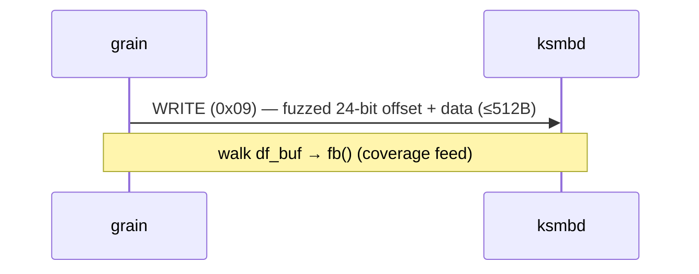
```mermaid
sequenceDiagram
    participant G as grain
    participant S as ksmbd
    G->>S: WRITE (0x09) — fuzzed 24-bit offset + data (≤512B)
    Note over G,S: walk df_buf → fb() (coverage feed)
```

#### 2. `write_ext`
_Fuzzes SMB2 WRITE with a FULL 64-bit offset (holes / &gt;4GB / ~2^63) on the authed fd (smbc_write); sparse/boundary write bug class._

```mermaid
sequenceDiagram
    participant G as grain
    participant S as ksmbd
    G->>S: WRITE (0x09) — fuzzed 64-bit offset + data (≤512B)
    Note over G,S: walk df_buf → fb() (coverage feed)
```

#### 3. `stream_write`
_Alternate-data-stream write: opens "sfile:&lt;fuzzed-stream-name&gt;:$DATA" and writes fuzzed data → ksmbd streams_xattr stream-name parse + xattr-backed store._

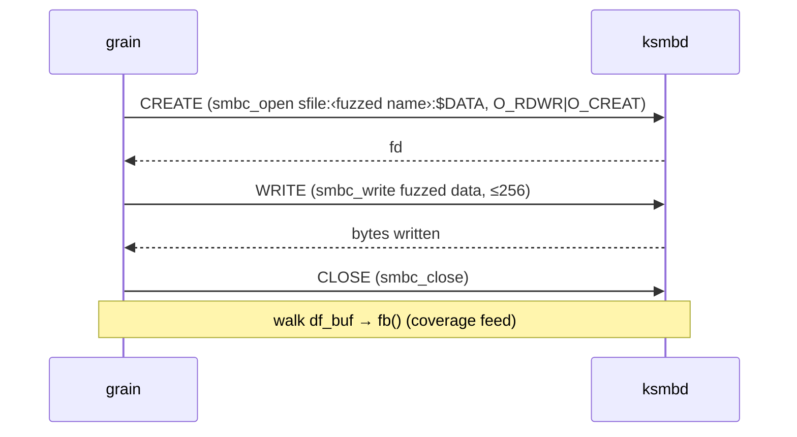
```mermaid
sequenceDiagram
    participant G as grain
    participant S as ksmbd
    G->>S: CREATE (smbc_open sfile:‹fuzzed name›:$DATA, O_RDWR|O_CREAT)
    S-->>G: fd
    G->>S: WRITE (smbc_write fuzzed data, ≤256)
    S-->>G: bytes written
    G->>S: CLOSE (smbc_close)
    Note over G,S: walk df_buf → fb() (coverage feed)
```

#### 4. `write_flags`
_Raw SMB2 WRITE with fuzzed WriteFlags (WRITETHROUGH/UNBUFFERED) and a bounded Offset → write-through / direct-IO paths._

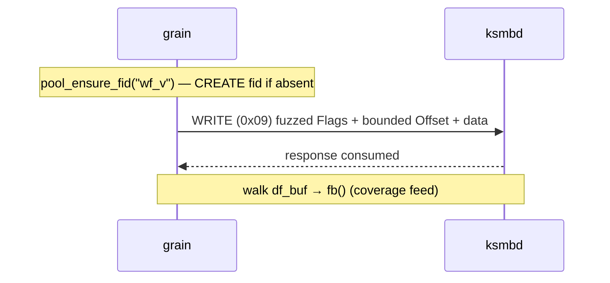
```mermaid
sequenceDiagram
    participant G as grain
    participant S as ksmbd
    Note over G: pool_ensure_fid("wf_v") — CREATE fid if absent
    G->>S: WRITE (0x09) fuzzed Flags + bounded Offset + data
    S-->>G: response consumed
    Note over G,S: walk df_buf → fb() (coverage feed)
```

#### 5. `append`
_Seeks to EOF on the libsmbclient fd and writes fuzzed data → the file-grow / allocation path (chunked-upload style)._

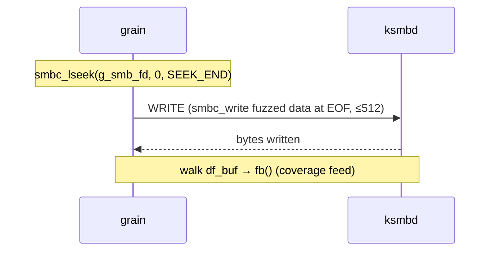
```mermaid
sequenceDiagram
    participant G as grain
    participant S as ksmbd
    Note over G: smbc_lseek(g_smb_fd, 0, SEEK_END)
    G->>S: WRITE (smbc_write fuzzed data at EOF, ≤512)
    S-->>G: bytes written
    Note over G,S: walk df_buf → fb() (coverage feed)
```

#### 6. `write_compound_flush`
_A single compound (RELATED) request chaining WRITE→FLUSH→WRITE on one fid — compound-request write/flush ordering._

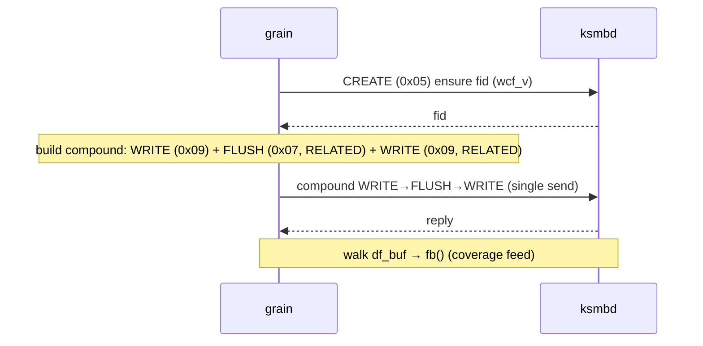
```mermaid
sequenceDiagram
    participant G as grain
    participant S as ksmbd
    G->>S: CREATE (0x05) ensure fid (wcf_v)
    S-->>G: fid
    Note over G: build compound: WRITE (0x09) + FLUSH (0x07, RELATED) + WRITE (0x09, RELATED)
    G->>S: compound WRITE→FLUSH→WRITE (single send)
    S-->>G: reply
    Note over G,S: walk df_buf → fb() (coverage feed)
```

#### 7. `write_zero_length`
_WRITE with Length=0 but a non-zero DataOffset — zero-length write with dangling data offset._

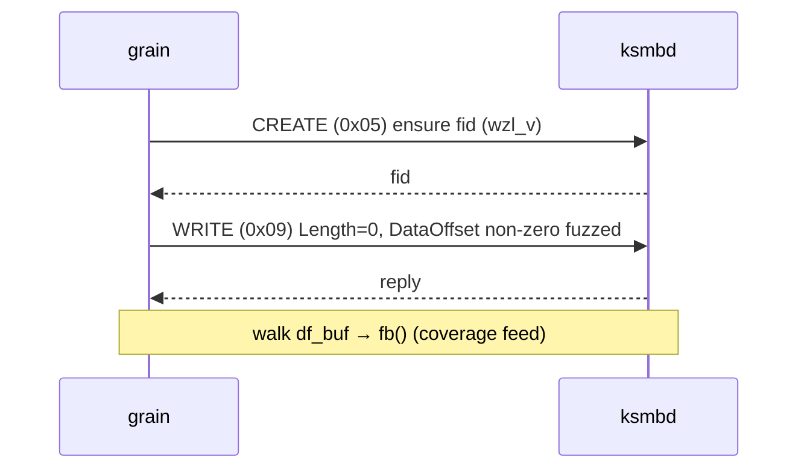
```mermaid
sequenceDiagram
    participant G as grain
    participant S as ksmbd
    G->>S: CREATE (0x05) ensure fid (wzl_v)
    S-->>G: fid
    G->>S: WRITE (0x09) Length=0, DataOffset non-zero fuzzed
    S-->>G: reply
    Note over G,S: walk df_buf → fb() (coverage feed)
```

#### 8. `write_sparse_hole`
_IOCTL FSCTL_SET_SPARSE then 3 WRITEs at scattered fuzzed offsets leaving holes between them — sparse-file hole allocation._

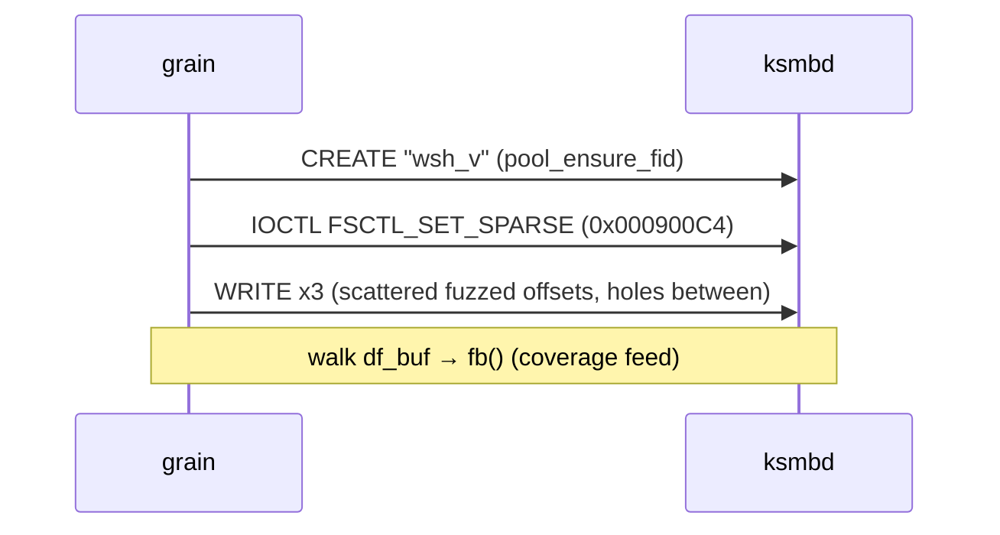
```mermaid
sequenceDiagram
    participant G as grain
    participant S as ksmbd
    G->>S: CREATE "wsh_v" (pool_ensure_fid)
    G->>S: IOCTL FSCTL_SET_SPARSE (0x000900C4)
    G->>S: WRITE x3 (scattered fuzzed offsets, holes between)
    Note over G,S: walk df_buf → fb() (coverage feed)
```

#### 9. `append_past_max`
_Loop of 3 WRITEs at monotonically growing offsets on one fid — append/offset overflow bug class._

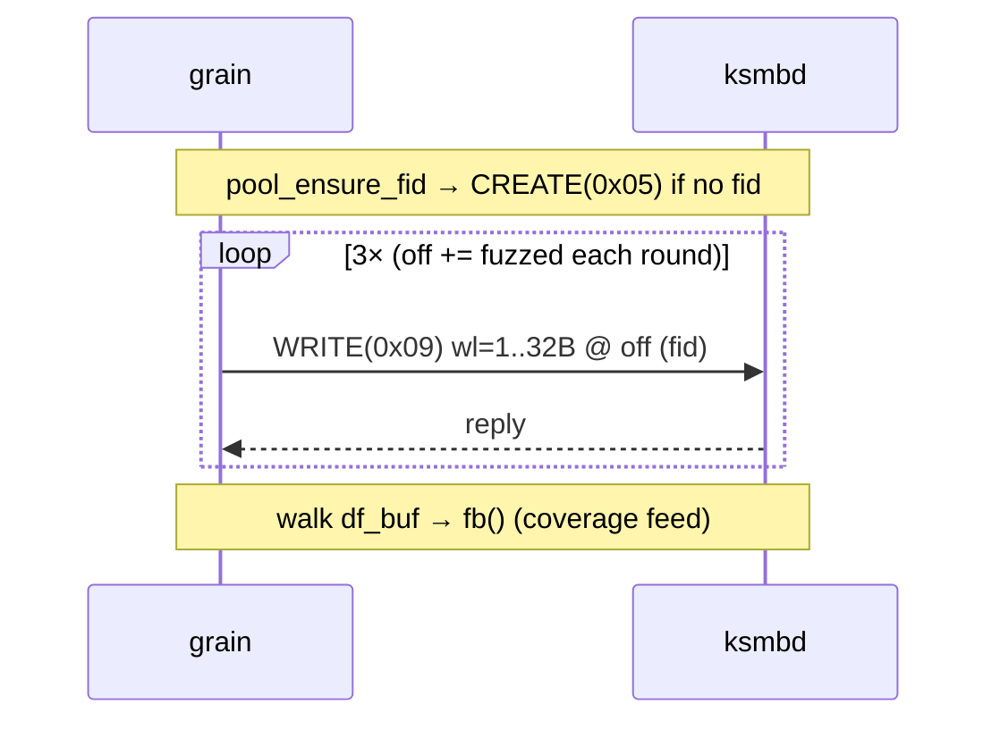
```mermaid
sequenceDiagram
    participant G as grain
    participant S as ksmbd
    Note over G,S: pool_ensure_fid → CREATE(0x05) if no fid
    loop 3× (off += fuzzed each round)
        G->>S: WRITE(0x09) wl=1..32B @ off (fid)
        S-->>G: reply
    end
    Note over G,S: walk df_buf → fb() (coverage feed)
```

#### 0x08 READ

#### 10. `read`
_Fuzzes SMB2 READ (0x08) Flags/Length/Offset/MinimumCount/Channel on the pool fid — read-boundary / length-overflow bug class._

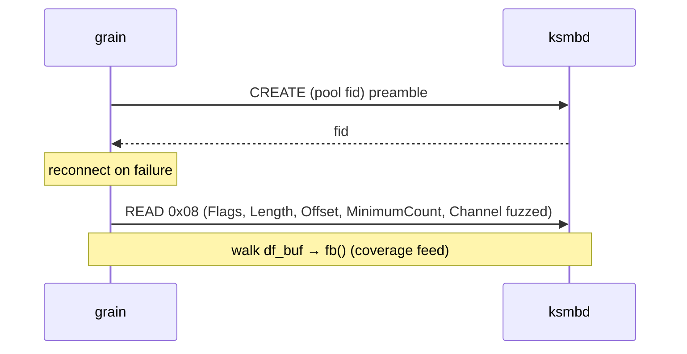
```mermaid
sequenceDiagram
    participant G as grain
    participant S as ksmbd
    G->>S: CREATE (pool fid) preamble
    S-->>G: fid
    Note over G: reconnect on failure
    G->>S: READ 0x08 (Flags, Length, Offset, MinimumCount, Channel fuzzed)
    Note over G,S: walk df_buf → fb() (coverage feed)
```

#### 11. `read_padding_edge`
_READ with fuzzed Padding, Flags and MinimumCount versus Length — read-padding / minimum-count edge._

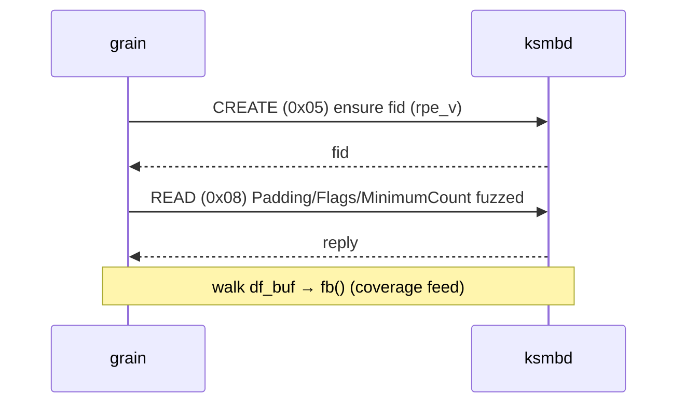
```mermaid
sequenceDiagram
    participant G as grain
    participant S as ksmbd
    G->>S: CREATE (0x05) ensure fid (rpe_v)
    S-->>G: fid
    G->>S: READ (0x08) Padding/Flags/MinimumCount fuzzed
    S-->>G: reply
    Note over G,S: walk df_buf → fb() (coverage feed)
```

#### 12. `read_beyond_eof`
_READ with an overflowing Length (~0xFFFFFFF0) and overflowing Offset — read integer overflow past EOF._

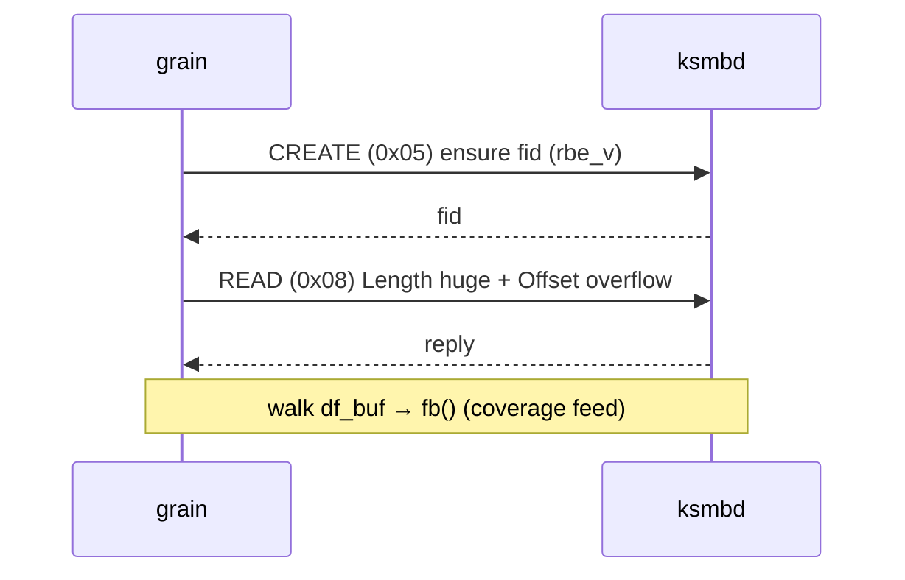
```mermaid
sequenceDiagram
    participant G as grain
    participant S as ksmbd
    G->>S: CREATE (0x05) ensure fid (rbe_v)
    S-->>G: fid
    G->>S: READ (0x08) Length huge + Offset overflow
    S-->>G: reply
    Note over G,S: walk df_buf → fb() (coverage feed)
```

#### 0x05 CREATE

#### 13. `session_max_opens`
_Loop of many CREATEs (op00..) with no CLOSE — exhausts the per-session open-file table._

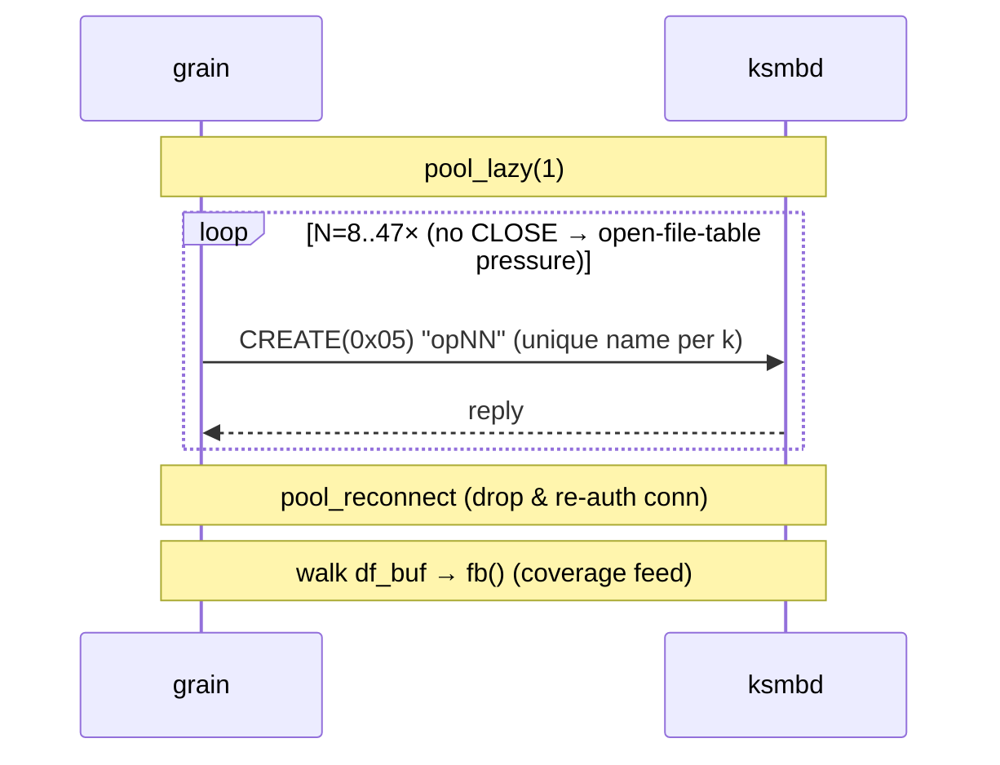
```mermaid
sequenceDiagram
    participant G as grain
    participant S as ksmbd
    Note over G,S: pool_lazy(1)
    loop N=8..47× (no CLOSE → open-file-table pressure)
        G->>S: CREATE(0x05) "opNN" (unique name per k)
        S-->>G: reply
    end
    Note over G,S: pool_reconnect (drop & re-auth conn)
    Note over G,S: walk df_buf → fb() (coverage feed)
```

#### 0x0A LOCK

#### 14. `lock`
_Fuzzes SMB2 LOCK (0x0A) LockSequence/Offset/Length/Flags on the pool fid — byte-range lock SHARED/EXCL/UNLOCK state bug class._

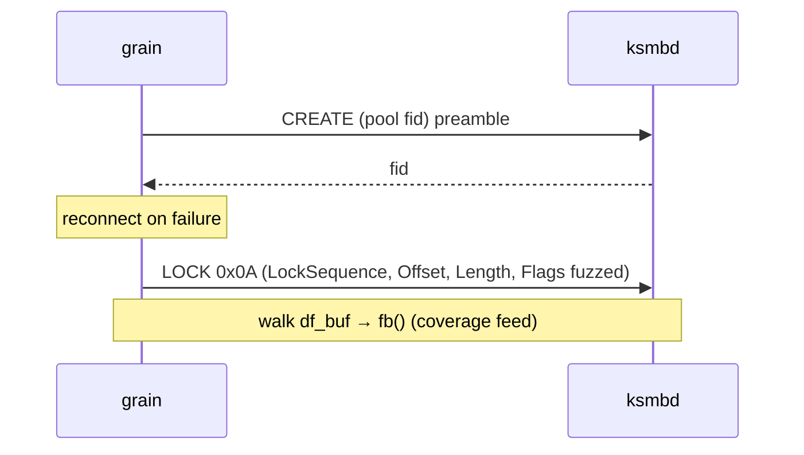
```mermaid
sequenceDiagram
    participant G as grain
    participant S as ksmbd
    G->>S: CREATE (pool fid) preamble
    S-->>G: fid
    Note over G: reconnect on failure
    G->>S: LOCK 0x0A (LockSequence, Offset, Length, Flags fuzzed)
    Note over G,S: walk df_buf → fb() (coverage feed)
```

#### 15. `lock_array`

_SMB2 LOCK with LockCount 2-8 and an independently-fuzzed lock-element array — smb2_lock() per-element for-loop over lock_ele[i] (overlap/huge/inverted Offset+Length; find.md #1 surface)._

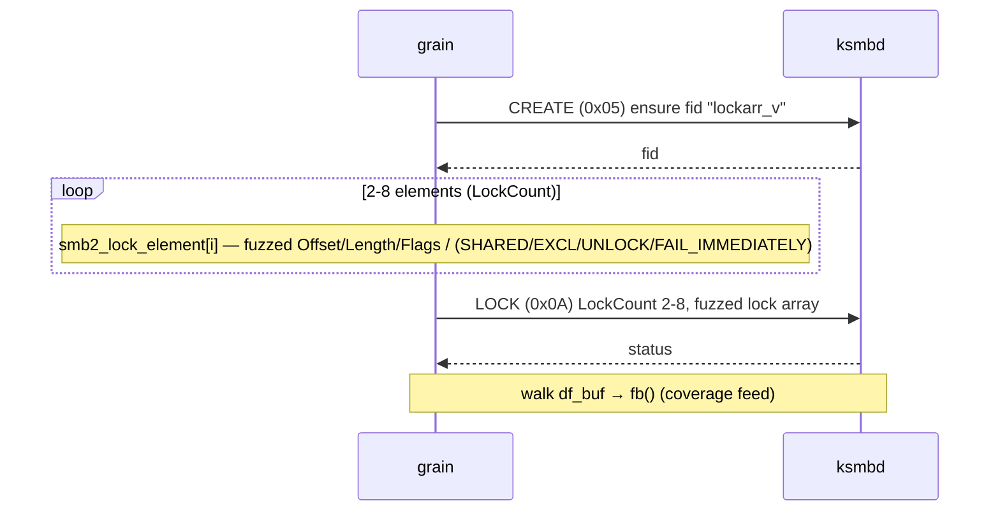
```mermaid
sequenceDiagram
    participant G as grain
    participant S as ksmbd
    G->>S: CREATE (0x05) ensure fid "lockarr_v"
    S-->>G: fid
    loop 2-8 elements (LockCount)
        Note over G: smb2_lock_element[i] — fuzzed Offset/Length/Flags / (SHARED/EXCL/UNLOCK/FAIL_IMMEDIATELY)
    end
    G->>S: LOCK (0x0A) LockCount 2-8, fuzzed lock array
    S-->>G: status
    Note over G,S: walk df_buf → fb() (coverage feed)
```

#### 16. `lock_unlock_mismatch`
_LOCK with UNLOCK flag on a range that was never locked plus a mismatched LockSequenceNumber — unlock-without-lock state._

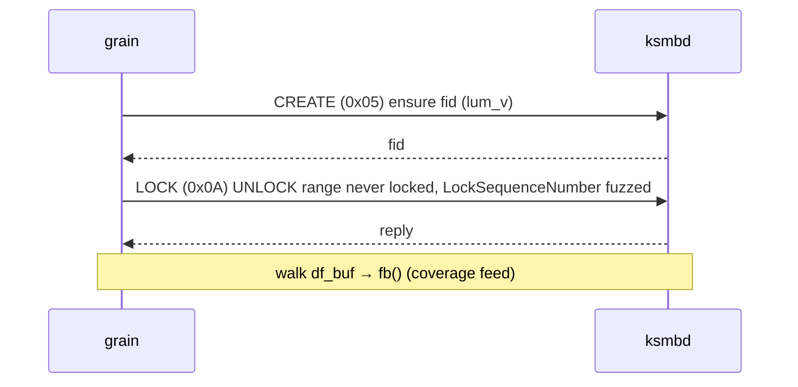
```mermaid
sequenceDiagram
    participant G as grain
    participant S as ksmbd
    G->>S: CREATE (0x05) ensure fid (lum_v)
    S-->>G: fid
    G->>S: LOCK (0x0A) UNLOCK range never locked, LockSequenceNumber fuzzed
    S-->>G: reply
    Note over G,S: walk df_buf → fb() (coverage feed)
```

#### 17. `lock_shared_excl_conflict`
_Two connections lock the same range — C shared then C2 exclusive (FAIL_IMMEDIATELY) — cross-handle lock conflict._

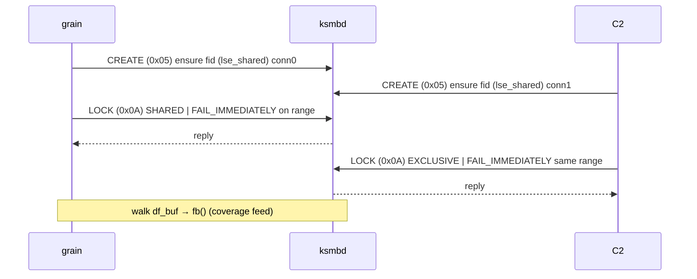
```mermaid
sequenceDiagram
    participant G as grain
    participant S as ksmbd
    participant C2 as C2
    G->>S: CREATE (0x05) ensure fid (lse_shared) conn0
    C2->>S: CREATE (0x05) ensure fid (lse_shared) conn1
    G->>S: LOCK (0x0A) SHARED | FAIL_IMMEDIATELY on range
    S-->>G: reply
    C2->>S: LOCK (0x0A) EXCLUSIVE | FAIL_IMMEDIATELY same range
    S-->>C2: reply
    Note over G,S: walk df_buf → fb() (coverage feed)
```

#### 18. `lock_reflexive`
_Same fid locks the identical range twice with a fuzzed lock flag — self-conflicting reflexive lock._

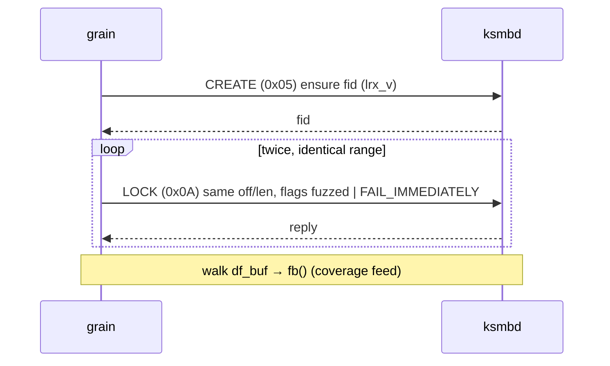
```mermaid
sequenceDiagram
    participant G as grain
    participant S as ksmbd
    G->>S: CREATE (0x05) ensure fid (lrx_v)
    S-->>G: fid
    loop twice, identical range
        G->>S: LOCK (0x0A) same off/len, flags fuzzed | FAIL_IMMEDIATELY
        S-->>G: reply
    end
    Note over G,S: walk df_buf → fb() (coverage feed)
```

#### 0x07 FLUSH

#### 19. `flush`
_Fuzzes SMB2 FLUSH (0x07) Reserved1/Reserved2 on the pool fid — reserved-field handling / flush path bug class._

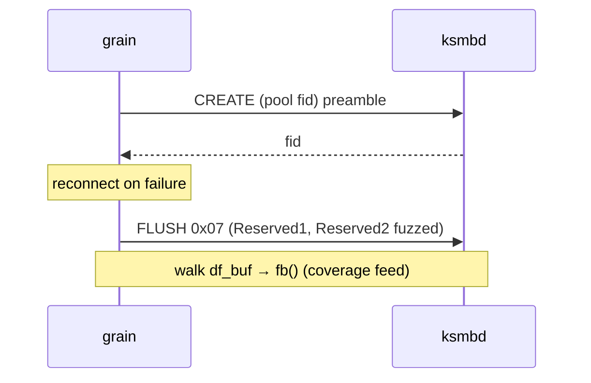
```mermaid
sequenceDiagram
    participant G as grain
    participant S as ksmbd
    G->>S: CREATE (pool fid) preamble
    S-->>G: fid
    Note over G: reconnect on failure
    G->>S: FLUSH 0x07 (Reserved1, Reserved2 fuzzed)
    Note over G,S: walk df_buf → fb() (coverage feed)
```

#### 0x10 QUERY_INFO

#### 20. `query_info`
_Fuzzes SMB2 QUERY_INFO (0x10) InfoType/FileInfoClass/AdditionalInformation/Flags on the pool fid — info-class dispatch / parser bug class._

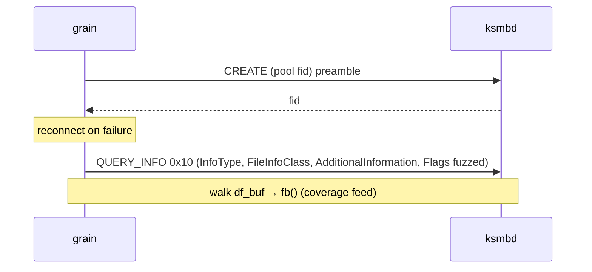
```mermaid
sequenceDiagram
    participant G as grain
    participant S as ksmbd
    G->>S: CREATE (pool fid) preamble
    S-->>G: fid
    Note over G: reconnect on failure
    G->>S: QUERY_INFO 0x10 (InfoType, FileInfoClass, AdditionalInformation, Flags fuzzed)
    Note over G,S: walk df_buf → fb() (coverage feed)
```

#### 21. `query_fs_info`
_QUERY_INFO InfoType=FILESYSTEM with a fuzzed FsInfoClass (1–12) — filesystem-info query handlers._

```mermaid
sequenceDiagram
    participant G as grain
    participant S as ksmbd
    G->>S: CREATE (0x05) open pool fid "qfs_v"
    S-->>G: fid
    G->>S: QUERY_INFO (0x10) InfoType=FILESYSTEM, FsInfoClass fuzzed
    S-->>G: reply
    Note over G,S: walk df_buf → fb() (coverage feed)
```

#### 22. `query_info_ea_list`
_QUERY_INFO FILE_FULL_EA_INFORMATION with a fuzzed EaList whose NextEntryOffset chain is corrupted — EA-list traversal OOB._

```mermaid
sequenceDiagram
    participant G as grain
    participant S as ksmbd
    G->>S: CREATE (0x05) ensure fid (qeal_v)
    S-->>G: fid
    G->>S: QUERY_INFO (0x10) FILE_FULL_EA_INFORMATION, EaList NextEntryOffset fuzzed
    S-->>G: reply
    Note over G,S: walk df_buf → fb() (coverage feed)
```

#### 23. `query_all_info`
_QUERY_INFO FILE_ALL_INFORMATION (class 18) with a fuzzed AdditionalInformation on the pool fid._

```mermaid
sequenceDiagram
    participant G as grain
    participant S as ksmbd
    Note over G,S: pool_ensure_fid → CREATE if needed
    G->>S: QUERY_INFO (0x10, FILE_ALL_INFORMATION cls 18, fuzzed AddlInfo)
    S-->>G: info reply
    Note over G,S: walk df_buf → fb() (coverage feed)
```

#### 24. `query_stream_info`
_QUERY_INFO FILE_STREAM_INFORMATION (class 22) with a fuzzed AdditionalInformation on the pool fid._

```mermaid
sequenceDiagram
    participant G as grain
    participant S as ksmbd
    Note over G,S: pool_ensure_fid → CREATE if needed
    G->>S: QUERY_INFO (0x10, FILE_STREAM_INFORMATION cls 22, fuzzed AddlInfo)
    S-->>G: info reply
    Note over G,S: walk df_buf → fb() (coverage feed)
```

#### 25. `query_network_openinfo`
_QUERY_INFO cycling info classes NETWORK_OPEN/INTERNAL/ATTR_TAG/STANDARD/EA with fuzzed AdditionalInformation._

```mermaid
sequenceDiagram
    participant G as grain
    participant S as ksmbd
    Note over G,S: pool_ensure_fid → CREATE if needed
    G->>S: QUERY_INFO (0x10, cls ∈ {34,6,35,5,21}, fuzzed AddlInfo)
    S-->>G: info reply
    Note over G,S: walk df_buf → fb() (coverage feed)
```

#### 26. `query_full_ea_size`
_QUERY_INFO FileFullEaInformation with a tiny OutputBufferLength — EA-buffer truncation/size bug class._

```mermaid
sequenceDiagram
    participant G as grain
    participant S as ksmbd
    Note over G,S: pool_ensure_fid → CREATE(0x05) if no fid
    G->>S: QUERY_INFO(0x10) FILE / FileFullEaInformation(15), OutBufLen = val%32 (fid)
    S-->>G: reply
    Note over G,S: walk df_buf → fb() (coverage feed)
```

#### 27. `query_attr_tag_reparse`
_FSCTL_SET_REPARSE_POINT(0x000900A4) via IOCTL then QUERY_INFO FileAttributeTagInformation — reparse-point tag handling bug class._

```mermaid
sequenceDiagram
    participant G as grain
    participant S as ksmbd
    Note over G,S: pool_ensure_fid → CREATE(0x05) if no fid
    G->>S: IOCTL(0x0B) FSCTL_SET_REPARSE_POINT(0x000900A4), tag 0xA000000C (fid)
    S-->>G: reply
    G->>S: QUERY_INFO(0x10) FILE / FileAttributeTagInformation(35) (fid)
    S-->>G: reply
    Note over G,S: walk df_buf → fb() (coverage feed)
```

#### 0x0E QUERY_DIRECTORY

#### 28. `query_dir`
_Enumerates a fuzzer-steered subpath of the share (smbc_opendir/readdir); QUERY_DIRECTORY + path-resolution / dir-iteration bug class._

```mermaid
sequenceDiagram
    participant G as grain
    participant S as ksmbd
    G->>S: CREATE dir — fuzzed subpath (0x05)
    S-->>G: dir fid
    Note over G: reconnect on failure — falls back to share root
    loop up to 512 entries
        G->>S: QUERY_DIRECTORY (0x0E)
        S-->>G: dirents
    end
    G->>S: CLOSE (0x06)
    Note over G,S: walk df_buf → fb() (coverage feed)
```

#### 29. `dir_pattern`

_Open the share root as a directory then QUERY_DIRECTORY with a wildcard-dense UTF-16 search pattern — misc.c match_pattern() '*'/'?' backtracker._

```mermaid
sequenceDiagram
    participant G as grain
    participant S as ksmbd
    G->>S: CREATE (0x05) share root as directory (NameLength=0)
    S-->>G: directory fid
    Note over G: build UTF-16LE pattern, 4-44 dense '*'/'?'/fuzz chars
    G->>S: QUERY_DIRECTORY (0x0E) fuzzed InfoClass/Flags + wildcard pattern
    S-->>G: dir entries / status
    Note over G,S: walk df_buf → fb() (coverage feed)
```

#### 30. `query_dir_resume`

_Opens a directory then fuzzes QUERY_DIRECTORY resume state (FileIndex + INDEX_SPECIFIED flag + search pattern) to exercise resume-key handling._

```mermaid
sequenceDiagram
    participant G as grain
    participant S as ksmbd
    G->>S: CREATE (0x05) directory open
    S-->>G: reply (capture dfid)
    G->>S: QUERY_DIRECTORY (0x0E) INDEX_SPECIFIED, fuzzed FileIndex + pattern
    S-->>G: reply
    Note over G,S: walk df_buf → fb() (coverage feed)
```

#### 31. `query_dir_short_buf`
_CREATE a directory then QUERY_DIRECTORY with OutputBufferLength smaller than one entry — directory-enumeration short-buffer bug class._

```mermaid
sequenceDiagram
    participant G as grain
    participant S as ksmbd
    G->>S: CREATE(0x05) directory (DirAccess 0x100081, opt 0x01)
    S-->>G: reply → dir fid (STATUS_SUCCESS required)
    G->>S: QUERY_DIRECTORY(0x0E) "*", OutBufLen = val%24 ‹ one entry (dir fid)
    S-->>G: reply
    Note over G,S: walk df_buf → fb() (coverage feed)
```

#### 0x0F CHANGE_NOTIFY

#### 32. `notify`
_Fuzzes SMB2 CHANGE_NOTIFY (0x0F) Flags/OutputBufferLength/CompletionFilter on the pool fid — watch-tree / notify-buffer bug class._

```mermaid
sequenceDiagram
    participant G as grain
    participant S as ksmbd
    G->>S: CREATE (pool fid) preamble
    S-->>G: fid
    Note over G: reconnect on failure
    G->>S: CHANGE_NOTIFY 0x0F (Flags, OutputBufferLength, CompletionFilter fuzzed)
    Note over G,S: walk df_buf → fb() (coverage feed)
```

#### 33. `notify_output_walk`

_Opens a directory then fuzzes CHANGE_NOTIFY Flags/OutputBufferLength/CompletionFilter to walk the notify output-buffer boundary._

```mermaid
sequenceDiagram
    participant G as grain
    participant S as ksmbd
    G->>S: CREATE (0x05) directory open
    S-->>G: reply (capture dfid)
    G->>S: CHANGE_NOTIFY (0x0F) fuzzed Flags/OutputBufferLength/CompletionFilter
    S-->>G: reply
    Note over G,S: walk df_buf → fb() (coverage feed)
```

#### 0x06 CLOSE

#### 34. `close`
_Fuzzes SMB2 CLOSE (0x06) Flags/Reserved on the pool fid then optionally double-closes the same stale FileId — use-after-close / double-close UAF bug class._

```mermaid
sequenceDiagram
    participant G as grain
    participant S as ksmbd
    G->>S: CREATE (pool fid) preamble
    S-->>G: fid
    Note over G: reconnect on failure
    G->>S: CLOSE 0x06 (Flags, Reserved fuzzed)
    G->>S: CLOSE 0x06 (SAME now-stale FileId, data-gated double-close)
    Note over G: has_fid cleared — fid re-open next grain
    Note over G,S: walk df_buf → fb() (coverage feed)
```

#### 0x0C CANCEL

#### 35. `cancel`
_Fuzzes SMB2 CANCEL (0x0C) MessageId on the authed pool connection — async-op teardown / stale-MID bug class._

```mermaid
sequenceDiagram
    participant G as grain
    participant S as ksmbd
    Note over G: pool_lazy — authed conn (lazy)
    G->>S: CANCEL 0x0C (MessageId fuzzed)
    Note over G,S: walk df_buf → fb() (coverage feed)
```

#### 36. `cancel_async_target`
_Fires a blocking async LOCK then a CANCEL targeting its MID (real or fuzzed) — races async request cancellation._

```mermaid
sequenceDiagram
    participant G as grain
    participant S as ksmbd
    G->>S: CREATE (0x05) open pool fid "cancel_v"
    S-->>G: fid
    G->>S: LOCK (0x0A) blocking/async (send_only, no wait)
    G->>S: CANCEL (0x0C) targeting lock MID (real or fuzzed)
    S-->>G: reply
    Note over G,S: pool_reconnect → restore conn
    Note over G,S: walk df_buf → fb() (coverage feed)
```

#### 0x0D ECHO

#### 37. `echo`
_Fuzzes SMB2 ECHO (0x0D) Reserved field on the authed pool connection — keepalive / reserved-field bug class._

```mermaid
sequenceDiagram
    participant G as grain
    participant S as ksmbd
    Note over G: pool_lazy — authed conn (lazy)
    G->>S: ECHO 0x0D (Reserved fuzzed)
    Note over G,S: walk df_buf → fb() (coverage feed)
```

#### 0x03 TREE_CONNECT

#### 38. `tcon`
_Raw SMB2 TREE_CONNECT with a fuzzed Flags field and fuzzed UNC path bytes → ksmbd tree-connect / share-lookup parsing (path confusion)._

```mermaid
sequenceDiagram
    participant G as grain
    participant S as ksmbd
    Note over G: pool_lazy(1) ensure authed pool conn
    G->>S: TREE_CONNECT (0x03) fuzzed Flags + UNC path \\ip\‹fuzzed›
    S-->>G: response consumed
    Note over G,S: walk df_buf → fb() (coverage feed)
```

#### 39. `tcon_ipc_vs_disk`
_TREE_CONNECT to IPC$ then a disk-style CREATE on that IPC tid to trigger tree-type (pipe vs share) confusion._

```mermaid
sequenceDiagram
    participant G as grain
    participant S as ksmbd
    G->>S: TREE_CONNECT (0x03, \\127.0.0.1\IPC$)
    S-->>G: reply (capture ipc_tid)
    G->>S: CREATE (0x05, disk-file "ipc_confuse" on IPC$ tid)
    S-->>G: create reply
    Note over G,S: restore saved tid
    Note over G,S: walk df_buf → fb() (coverage feed)
```

#### 40. `casefold_share_name`
_TREE_CONNECT with a UNC path whose share name is fuzzed for case-folding and non-ASCII (0x80+) code units — share-name normalization/case handling._

```mermaid
sequenceDiagram
    participant G as grain
    participant S as ksmbd
    G->>S: TREE_CONNECT (\\127.0.0.1\ + fuzzed mixed-case / non-ASCII share name)
    Note over G,S: walk df_buf → fb() (coverage feed)
```

#### 41. `tcon_max_trees`
_Loop of many TREE_CONNECTs with no TREE_DISCONNECT — exhausts the per-session tree-connection table._

```mermaid
sequenceDiagram
    participant G as grain
    participant S as ksmbd
    Note over G,S: pool_lazy(1)
    loop N=8..47× (no TREE_DISCONNECT → tree-table pressure)
        G->>S: TREE_CONNECT(0x03) \\127.0.0.1\share
        S-->>G: reply
    end
    Note over G,S: pool_reconnect (drop & re-auth conn)
    Note over G,S: walk df_buf → fb() (coverage feed)
```

#### 0x04 TREE_DISCONNECT

#### 42. `tdis`
_Fuzzes SMB2 TREE_DISCONNECT (0x04) TreeId on the authed pool connection — stale-tree teardown bug class._

```mermaid
sequenceDiagram
    participant G as grain
    participant S as ksmbd
    Note over G: pool_lazy — authed conn (lazy)
    G->>S: TREE_DISCONNECT 0x04 (TreeId fuzzed)
    Note over G: has_fid cleared — fid re-open next grain
    Note over G,S: walk df_buf → fb() (coverage feed)
```

#### 43. `tdis_open_fid`
_TREE_DISCONNECT issued while a fid is still open on the pool conn — tests use-after-tree-teardown fid handling._

```mermaid
sequenceDiagram
    participant G as grain
    participant S as ksmbd
    G->>S: CREATE (0x05) open pool fid "tdis_open_v"
    S-->>G: fid
    G->>S: TREE_DISCONNECT (0x04) tree still holding open fid
    S-->>G: reply
    Note over G,S: pool_reconnect → restore torn-down tree
    Note over G,S: walk df_buf → fb() (coverage feed)
```

#### 0x01 SESSION_SETUP

#### 44. `session_setup`
_Dedicated SESSION_SETUP auth-fuzz: fuzzes Flags/SecurityMode/Capabilities plus the whole SPNEGO/NTLMSSP security blob → ksmbd auth / ASN.1 decode surface._

```mermaid
sequenceDiagram
    participant G as grain
    participant S as ksmbd
    Note over G: pool_lazy(1) ensure authed pool conn
    G->>S: SESSION_SETUP (0x01) fuzzed Flags/SecurityMode/Capabilities + SPNEGO/NTLMSSP blob
    S-->>G: response consumed
    Note over G,S: walk df_buf → fb() (coverage feed)
```

#### 45. `spnego_asn1`

_Fuzzes a SESSION_SETUP SPNEGO/DER security blob (GSS-API tag + SPNEGO OID + NegTokenInit TLV lengths) to stress the ASN.1/GSS-API decode path; may disrupt session (auto-reconnect)._

```mermaid
sequenceDiagram
    participant G as grain
    participant S as ksmbd
    Note over G,S: pool_lazy(1) — authed conn
    Note over G: build SPNEGO DER blob, fuzzed GSS/NegTokenInit/SEQUENCE lengths
    G->>S: SESSION_SETUP (0x01) fuzzed SPNEGO blob
    S-->>G: reply (may disrupt session → pool re-auth)
    Note over G,S: walk df_buf → fb() (coverage feed)
```

#### 46. `session_reauth_switch`
_SESSION_SETUP re-auth on the existing SessionId with a fuzzed different-user NTLMSSP blob, then reconnect — session re-authentication / user-switch._

```mermaid
sequenceDiagram
    participant G as grain
    participant S as ksmbd
    G->>S: SESSION_SETUP (0x01) existing sid, different-user NTLMSSP blob fuzzed
    S-->>G: reply
    Note over G: pool_reconnect(conn0) re-establish session
    Note over G,S: walk df_buf → fb() (coverage feed)
```

#### 47. `guest_anon_auth`
_Raw-socket SESSION_SETUP with a fuzzed NTLMSSP type-1 NegotiateFlags to force guest/anonymous downgrade auth-bypass._

```mermaid
sequenceDiagram
    participant G as grain
    participant S as ksmbd
    G->>S: NEGOTIATE (0x00, raw sock, dialect 0x0311)
    S-->>G: neg reply
    G->>S: SESSION_SETUP (0x01, NTLMSSP type-1, fuzzed NegotiateFlags)
    S-->>G: setup reply
    Note over G,S: walk df_buf → fb() (coverage feed)
```

#### 48. `gss_mechlist_mic`
_SESSION_SETUP carrying a hand-built SPNEGO blob with a fuzzed [3] mechListMIC OCTET STRING length/body — GSS/SPNEGO negTokenInit parser._

```mermaid
sequenceDiagram
    participant G as grain
    participant S as ksmbd
    G->>S: SESSION_SETUP (SPNEGO negTokenInit, fuzzed [3] mechListMIC OCTET STRING)
    Note over G,S: pool_reconnect (tear + re-auth conn)
    Note over G,S: walk df_buf → fb() (coverage feed)
```

#### 49. `session_setup_no_negotiate`
_Raw socket sends SESSION_SETUP first with no prior NEGOTIATE — out-of-order state-machine bug class._

```mermaid
sequenceDiagram
    participant G as grain
    participant S as ksmbd
    Note over G,S: raw TCP connect :445 (no NEGOTIATE)
    G->>S: SESSION_SETUP(0x01) first, fuzzed blob (≤100B)
    S-->>G: reply (read)
    Note over G,S: socket closed (conn dropped)
    Note over G,S: walk df_buf → fb() (coverage feed)
```

#### 0x02 LOGOFF

#### 50. `logoff`
_Fuzzes SMB2 LOGOFF (0x02) optional SessionId + Reserved on the pool connection then forces re-auth — session-object lifetime / teardown UAF bug class._

```mermaid
sequenceDiagram
    participant G as grain
    participant S as ksmbd
    G->>S: CREATE (pool fid) preamble
    S-->>G: fid
    Note over G: reconnect on failure
    G->>S: LOGOFF 0x02 (optional fuzzed SessionId, Reserved fuzzed)
    Note over G: drop socket + clear sid/tid/fid — re-auth next grain
    Note over G,S: walk df_buf → fb() (coverage feed)
```

#### 51. `logoff_inflight`

_Fires a blocking SMB2 LOCK (no FAIL_IMMEDIATELY) then a LOGOFF while the lock is still inflight to race session teardown against a pending blocking wait._

```mermaid
sequenceDiagram
    participant G as grain
    participant S as ksmbd
    Note over G,S: pool_ensure_fid("logoff_v") → CREATE if no fid
    G->>S: LOCK (0x0A) SHARED blocking, fuzzed offset/len (send_only, no wait)
    G->>S: LOGOFF (0x02) while lock inflight
    S-->>G: reply
    Note over G,S: session torn down → pool_reconnect() restore
    Note over G,S: walk df_buf → fb() (coverage feed)
```

#### 52. `logoff_reuse_sid`
_LOGOFF then ECHO reusing the just-freed SessionId (or a fuzzed one) to probe session-teardown UAF/stale-SID handling._

```mermaid
sequenceDiagram
    participant G as grain
    participant S as ksmbd
    G->>S: LOGOFF (0x02, pool session)
    S-->>G: logoff reply
    G->>S: ECHO (0x0D, SessionId = stale sid or fuzzed)
    S-->>G: echo reply
    Note over G,S: reconnect pool (sid=0)
    Note over G,S: walk df_buf → fb() (coverage feed)
```

#### 0x00 NEGOTIATE

#### 53. `negotiate`
_Fires a raw SMB2 NEGOTIATE (dialect 0x0311) with fuzzed negotiate contexts, no session; context-parsing bug class._

```mermaid
sequenceDiagram
    participant G as grain
    participant S as ksmbd
    G->>S: TCP connect :445
    G->>S: NEGOTIATE (0x00) dialect 0x0311 + fuzzed contexts
    Note over G: reads response, discarded
    Note over G,S: walk df_buf → fb() (coverage feed)
```

#### 54. `negotiate_ctx_multi`

_Throwaway-socket NEGOTIATE with NegotiateContextCount 2-6 and N fuzzed contexts — deassemble_neg_contexts() array-walk + 2nd..Nth sub-decoders (preauth/compress/encrypt)._

```mermaid
sequenceDiagram
    participant G as grain
    participant S as ksmbd
    Note over G: throwaway socket connect :445 (does NOT touch pool)
    Note over G: NEGOTIATE dialect 3.1.1, NegotiateContextCount 2-6
    loop 2-6 contexts (NegotiateContextCount)
        Note over G: ContextType from preauth/enc/compress/netname/signing/posix / fuzzed DataLength + counts/salts/algs
    end
    G->>S: NEGOTIATE (0x00) multi-context (send + read, throwaway conn)
    S-->>G: response (read into df_buf)
    Note over G,S: walk df_buf → fb() (coverage feed)
```

#### 55. `negotiate_dialects`

_Fuzzes NEGOTIATE DialectCount 2-31 plus a mixed real/fuzzed dialect array to exercise smb2_handle_negotiate's dialect-selection loop; throwaway socket._

```mermaid
sequenceDiagram
    participant G as grain
    participant S as ksmbd
    Note over G: fresh TCP socket to :445, DialectCount 2-31, mixed real/fuzzed dialects
    G->>S: NEGOTIATE (0x00) (raw write, read reply)
    S-->>G: reply (discarded)
    Note over G,S: walk df_buf → fb() (coverage feed)
```

#### 56. `negotiate_signing_ctx`
_Fresh-socket NEGOTIATE with an SMB2_SIGNING_CAPABILITIES context whose SigningAlgorithmCount + algorithm array are fuzzed (count vs. array length mismatch) — negotiate context parser._

```mermaid
sequenceDiagram
    participant G as grain
    participant S as ksmbd
    Note over G,S: raw connect :445 (own socket, no pool)
    G->>S: NEGOTIATE (SMB2_SIGNING_CAPABILITIES ctx, SigningAlgorithmCount + fuzzed algo[] loop)
    S-->>G: NEGOTIATE resp (read into resp)
    Note over G,S: walk df_buf → fb() (coverage feed)
```

#### 57. `conn_negotiate_twice`
_Raw socket sends NEGOTIATE twice (2nd dialect fuzzed) on one connection — double-negotiate state-machine bug class._

```mermaid
sequenceDiagram
    participant G as grain
    participant S as ksmbd
    Note over G,S: raw TCP connect :445
    loop 2× (1st dialect 0x0311, 2nd fuzzed)
        G->>S: NEGOTIATE(0x00) re-negotiate on same conn
        S-->>G: reply (read)
    end
    Note over G,S: socket closed (conn dropped)
    Note over G,S: walk df_buf → fb() (coverage feed)
```

---

## 2. IOCTL / FSCTL codes (KSMBD `smb2_ioctl`)

| FSCTL | KSMBD | Grain | Notes |
|-------|-------|-------|-------|
| FSCTL_SRV_COPYCHUNK / _WRITE | ✅ | `copychunk` | server-side copy (write-side) |
| FSCTL_SET_COMPRESSION / GET | ✅ | `compress` | compression transform |
| FSCTL_SET_REPARSE_POINT / GET | ✅ | `reparse` | reparse/symlink (write-side) |
| FSCTL_PIPE_TRANSCEIVE | ✅ | `pipe` `ndr` | named-pipe RPC |
| FSCTL_SET_SPARSE | ✅ | ✅ `fsctl_sparse` | sparse flag (write-side) |
| FSCTL_SET_ZERO_DATA | ✅ | ✅ `fsctl_zero` | hole-punch — hit vfs_fallocate |
| FSCTL_DUPLICATE_EXTENTS_TO_FILE | ✅ | ✅ `fsctl_dupext` | block clone (write-side) |
| FSCTL_SET_COMPRESSION | ✅ | ✅ `fsctl_setcomp` | compression state |
| FSCTL_QUERY_ALLOCATED_RANGES | ✅ | ✅ `fsctl_qar` | allocated-ranges query |
| FSCTL_VALIDATE_NEGOTIATE_INFO | ✅ | ✅ `fsctl_valneg` | downgrade attack (session-level) |
| FSCTL_SRV_COPYCHUNK | ✅ | ✅ `copychunk` | server-side copy |
| FSCTL_SRV_COPYCHUNK_WRITE | ✅ | ✅ `copychunk_write` | **write variant (audit gap)** |
| FSCTL_SRV_REQUEST_RESUME_KEY | ✅ | ✅ `resume_key` | resume key (audit gap) |
| FSCTL_DFS_GET_REFERRALS | ✅ | ✅ `fsctl_dfs` | DFS path parsing |
| FSCTL_DFS_GET_REFERRALS_EX | ✅ | ✅ `fsctl_dfs_ex` | DFS EX (audit gap) |
| FSCTL_GET_REPARSE_POINT | ✅ | ✅ `get_reparse` | read reparse (audit gap) |
| FSCTL_GET_COMPRESSION | ✅ | ✅ `get_compression` | (audit gap) |
| FSCTL_QUERY_NETWORK_INTERFACE_INFO | ✅ | ✅ `fsctl_netif` | multichannel discovery |
| FSCTL_CREATE_OR_GET_OBJECT_ID | ✅ | ✅ `fsctl_objid` | object id |
| FSCTL_OFFLOAD_WRITE / READ | ➖ (default-reject) | ✅ `offload_write`/`offload_read` | not in ksmbd switch → reject path |
| FSCTL_DELETE_REPARSE_POINT | ➖ (default-reject) | ✅ `del_reparse` | not in ksmbd switch → reject path |
| (any / unimplemented FSCTL) | ➖ default | ✅ `fsctl_sweep` | fuzz full ctl-code range → reject robustness |

### Per-grain diagrams — FSCTL / IOCTL (38)

See §9 for the shared archetypes and reading guide.

#### 58. `copychunk`
_Fuzzes FSCTL_SRV_COPYCHUNK_WRITE chunk src/dst offsets + length across a real ResumeKey; copy-range bounds/overflow bug class._

```mermaid
sequenceDiagram
    participant G as grain
    participant S as ksmbd
    Note over G: bail if pool has no fid
    G->>S: CREATE cc_v (pool fid) (0x05)
    G->>S: CREATE copydst (0x05)
    S-->>G: dst_fid
    G->>S: CREATE pool_0 — re-open source (0x05)
    S-->>G: src_fid
    G->>S: IOCTL FSCTL_SRV_REQUEST_RESUME_KEY (0x0B)
    S-->>G: 24-byte ResumeKey
    G->>S: IOCTL FSCTL_SRV_COPYCHUNK_WRITE (0x0B) — n_chunks × fuzzed src/dst off + length
    Note over G,S: walk df_buf → fb() (coverage feed)
```

#### 59. `compress`
_Fires a raw SMB2 Compression Transform PDU (fuzzed algo + OriginalSize) with no session; decompressor bounds bug class._

```mermaid
sequenceDiagram
    participant G as grain
    participant S as ksmbd
    G->>S: TCP connect :445
    G->>S: Compression Transform PDU — fuzzed algo, OrigSize + data (send)
    Note over G: reads response, discarded
    Note over G,S: walk df_buf → fb() (coverage feed)
```

#### 60. `reparse`
_Fuzzes FSCTL_SET_REPARSE_POINT tag + data (symlink/junction injection); path-traversal bug class._

```mermaid
sequenceDiagram
    participant G as grain
    participant S as ksmbd
    Note over G: bail if pool has no fid
    G->>S: CREATE rp_v (pool fid) (0x05)
    S-->>G: fid
    G->>S: IOCTL FSCTL_SET_REPARSE_POINT (0x0B) — fuzzed tag + data
    Note over G,S: walk df_buf → fb() (coverage feed)
```

#### 61. `ndr`
_Opens the srvsvc pipe on IPC$ and sprays malformed DCE/RPC via FSCTL_PIPE_TRANSCEIVE; NDR/RPC decoder bug class._

```mermaid
sequenceDiagram
    participant G as grain
    participant S as ksmbd
    participant P as IPC$ pipe
    G->>S: TREE_CONNECT \\IPC$ (0x03)
    S-->>G: ipc_tid
    G->>P: CREATE \srvsvc (0x05)
    P-->>G: pipe_fid
    G->>P: IOCTL FSCTL_PIPE_TRANSCEIVE (0x0B) — fuzzed DCE/RPC (≤800B)
    Note over G,S: walk df_buf → fb() (coverage feed)
```

#### 62. `pipe`
_CREATEs an unknown/garbage pipe name on IPC$; pipe-name dispatch / lookup bug class._

```mermaid
sequenceDiagram
    participant G as grain
    participant S as ksmbd
    participant P as IPC$ pipe
    G->>S: TREE_CONNECT \\IPC$ (0x03)
    S-->>G: ipc_tid
    G->>P: CREATE (0x05) — fuzzed pipe name (≤200B)
    Note over G,S: walk df_buf → fb() (coverage feed)
```

#### 63. `fsctl_zero`
_IOCTL FSCTL_SET_ZERO_DATA on the pool fid with a fuzzed FileOffset/BeyondFinalZero range — integer/range validation & sparse-punch bug class._

```mermaid
sequenceDiagram
    participant G as G
    participant S as S
    G->>S: CREATE (pool fid, open "zero_v")
    S-->>G: fid captured
    Note over G: reconnect on failure
    G->>S: IOCTL FSCTL_SET_ZERO_DATA (fuzzed FileOffset, BeyondFinalZero)
    Note over G,S: walk df_buf → fb() (coverage feed)
```

#### 64. `fsctl_dupext`
_IOCTL FSCTL_DUPLICATE_EXTENTS_TO_FILE (source = self fid) with fuzzed offsets and ByteCount — extent-clone bounds/overlap bug class._

```mermaid
sequenceDiagram
    participant G as G
    participant S as S
    G->>S: CREATE (pool fid, open "dup_v")
    S-->>G: fid captured
    Note over G: reconnect on failure
    G->>S: IOCTL FSCTL_DUPLICATE_EXTENTS_TO_FILE (fuzzed SourceFileOffset, TargetFileOffset, ByteCount)
    Note over G,S: walk df_buf → fb() (coverage feed)
```

#### 65. `fsctl_sparse`
_IOCTL FSCTL_SET_SPARSE on the pool fid with a fuzzed on/off flag — sparse-attribute toggle bug class._

```mermaid
sequenceDiagram
    participant G as G
    participant S as S
    G->>S: CREATE (pool fid, open "ioctl_v")
    S-->>G: fid captured
    Note over G: reconnect on failure
    G->>S: IOCTL FSCTL_SET_SPARSE (fuzzed on/off flag)
    Note over G,S: walk df_buf → fb() (coverage feed)
```

#### 66. `fsctl_qar`
_IOCTL FSCTL_QUERY_ALLOCATED_RANGES on the pool fid with a fuzzed Offset/Length range — range-query bounds bug class._

```mermaid
sequenceDiagram
    participant G as G
    participant S as S
    G->>S: CREATE (pool fid, open "ioctl_v")
    S-->>G: fid captured
    Note over G: reconnect on failure
    G->>S: IOCTL FSCTL_QUERY_ALLOCATED_RANGES (fuzzed Offset, Length)
    Note over G,S: walk df_buf → fb() (coverage feed)
```

#### 67. `fsctl_setcomp`
_IOCTL FSCTL_SET_COMPRESSION on the pool fid with a fuzzed compression state — compression-attribute handler bug class._

```mermaid
sequenceDiagram
    participant G as G
    participant S as S
    G->>S: CREATE (pool fid, open "ioctl_v")
    S-->>G: fid captured
    Note over G: reconnect on failure
    G->>S: IOCTL FSCTL_SET_COMPRESSION (fuzzed state)
    Note over G,S: walk df_buf → fb() (coverage feed)
```

#### 68. `fsctl_objid`
_IOCTL FSCTL_CREATE_OR_GET_OBJECT_ID on the pool fid with no input — object-id handler bug class._

```mermaid
sequenceDiagram
    participant G as G
    participant S as S
    G->>S: CREATE (pool fid, open "ioctl_v")
    S-->>G: fid captured
    Note over G: reconnect on failure
    G->>S: IOCTL FSCTL_CREATE_OR_GET_OBJECT_ID (empty)
    Note over G,S: walk df_buf → fb() (coverage feed)
```

#### 69. `fsctl_valneg`
_Session-level IOCTL FSCTL_VALIDATE_NEGOTIATE_INFO (all-0xFF fid) with fuzzed input — negotiate-validation downgrade bug class._

```mermaid
sequenceDiagram
    participant G as G
    participant S as S
    G->>S: IOCTL FSCTL_VALIDATE_NEGOTIATE_INFO (session-level, all-0xFF fid, fuzzed input ≤64B)
    Note over G,S: walk df_buf → fb() (coverage feed)
```

#### 70. `fsctl_dfs`
_Session-level IOCTL FSCTL_DFS_GET_REFERRALS (all-0xFF fid) with a fuzzed MaxReferralLevel and UTF-16 path — DFS referral path-parse bug class._

```mermaid
sequenceDiagram
    participant G as G
    participant S as S
    G->>S: IOCTL FSCTL_DFS_GET_REFERRALS (session-level, all-0xFF fid, fuzzed MaxReferralLevel + UTF-16 path)
    Note over G,S: walk df_buf → fb() (coverage feed)
```

#### 71. `fsctl_netif`
_Session-level IOCTL FSCTL_QUERY_NETWORK_INTERFACE_INFO (all-0xFF fid) with no input — network-interface enumeration handler bug class._

```mermaid
sequenceDiagram
    participant G as G
    participant S as S
    G->>S: IOCTL FSCTL_QUERY_NETWORK_INTERFACE_INFO (session-level, all-0xFF fid, empty)
    Note over G,S: walk df_buf → fb() (coverage feed)
```

#### 72. `offload_write`

_Fuzzes FSCTL_OFFLOAD_WRITE (0x00098268) token-based server-side copy write side (up to 64 bytes input)._

```mermaid
sequenceDiagram
    participant G as grain
    participant S as ksmbd
    Note over G: reconnect on failure (ensure pool fid)
    G->>S: IOCTL (0x0B) FSCTL_OFFLOAD_WRITE 0x00098268, fuzzed input[≤64]
    S-->>G: reply
    Note over G,S: walk df_buf → fb() (coverage feed)
```

#### 73. `offload_read`

_Fuzzes FSCTL_OFFLOAD_READ (0x00094264) offload-read token (up to 32 bytes input)._

```mermaid
sequenceDiagram
    participant G as grain
    participant S as ksmbd
    Note over G: reconnect on failure (ensure pool fid)
    G->>S: IOCTL (0x0B) FSCTL_OFFLOAD_READ 0x00094264, fuzzed input[≤32]
    S-->>G: reply
    Note over G,S: walk df_buf → fb() (coverage feed)
```

#### 74. `del_reparse`

_Fuzzes FSCTL_DELETE_REPARSE_POINT (0x000900AC) reparse-point removal write side (up to 24 bytes input)._

```mermaid
sequenceDiagram
    participant G as grain
    participant S as ksmbd
    Note over G: reconnect on failure (ensure pool fid)
    G->>S: IOCTL (0x0B) FSCTL_DELETE_REPARSE_POINT 0x000900AC, fuzzed input[≤24]
    S-->>G: reply
    Note over G,S: walk df_buf → fb() (coverage feed)
```

#### 75. `copychunk_write`

_Fuzzes FSCTL_SRV_COPYCHUNK_WRITE (0x001480F2) with fuzzed SourceKey/ChunkCount/SourceOffset/TargetOffset/Length → server-side copy write variant._

```mermaid
sequenceDiagram
    participant G as grain
    participant S as ksmbd
    Note over G: reconnect on failure (ensure pool fid)
    G->>S: IOCTL (0x0B) FSCTL_SRV_COPYCHUNK_WRITE 0x001480F2, fuzzed SourceKey/ChunkCount/offsets/Length
    S-->>G: reply
    Note over G,S: walk df_buf → fb() (coverage feed)
```

#### 76. `resume_key`

_Drives FSCTL_SRV_REQUEST_RESUME_KEY (0x00140078) with empty input → resume-key generation path._

```mermaid
sequenceDiagram
    participant G as grain
    participant S as ksmbd
    Note over G: reconnect on failure (ensure pool fid)
    G->>S: IOCTL (0x0B) FSCTL_SRV_REQUEST_RESUME_KEY 0x00140078, no input
    S-->>G: reply
    Note over G,S: walk df_buf → fb() (coverage feed)
```

#### 77. `fsctl_dfs_ex`

_Fuzzes FSCTL_DFS_GET_REFERRALS_EX (0x000601B0) at session level (all-0xFF fid, no file) with up to 64 fuzzed bytes → DFS referral parser._

```mermaid
sequenceDiagram
    participant G as grain
    participant S as ksmbd
    G->>S: IOCTL (0x0B) FSCTL_DFS_GET_REFERRALS_EX 0x000601B0 (session fid 0xFF..), fuzzed input[≤64]
    S-->>G: reply
    Note over G,S: walk df_buf → fb() (coverage feed)
```

#### 78. `get_reparse`

_Drives FSCTL_GET_REPARSE_POINT (0x000900A8) with empty input → reparse-point read path._

```mermaid
sequenceDiagram
    participant G as grain
    participant S as ksmbd
    Note over G: reconnect on failure (ensure pool fid)
    G->>S: IOCTL (0x0B) FSCTL_GET_REPARSE_POINT 0x000900A8, no input
    S-->>G: reply
    Note over G,S: walk df_buf → fb() (coverage feed)
```

#### 79. `get_compression`

_Drives FSCTL_GET_COMPRESSION (0x0009003C) with empty input → compression-attribute read path._

```mermaid
sequenceDiagram
    participant G as grain
    participant S as ksmbd
    Note over G: reconnect on failure (ensure pool fid)
    G->>S: IOCTL (0x0B) FSCTL_GET_COMPRESSION 0x0009003C, no input
    S-->>G: reply
    Note over G,S: walk df_buf → fb() (coverage feed)
```

#### 80. `fsctl_sweep`

_Sweeps ANY FSCTL control code (fuzzed 4-byte ctl, including unimplemented) → default/reject dispatch paths (unexpected-op robustness)._

```mermaid
sequenceDiagram
    participant G as grain
    participant S as ksmbd
    Note over G: reconnect on failure (ensure pool fid)
    loop over FSCTL code range (fuzzed ctl, incl. unimplemented)
        G->>S: IOCTL (0x0B) ctl=fuzzed, fuzzed input tail
        S-->>G: reply
    end
    Note over G,S: walk df_buf → fb() (coverage feed)
```

#### 81. `rpc_opnum`

_DCE/RPC REQUEST over the IPC$ \srvsvc pipe with a fuzzed opnum + stub — ksmbd's RPC decoder / per-opnum dispatch (srvsvc/wkssvc/samr)._

```mermaid
sequenceDiagram
    participant G as grain
    participant S as ksmbd
    participant P as IPC$ pipe
    Note over G: build v5.0 REQUEST, fuzzed call_id/opnum + stub
    G->>S: TREE_CONNECT (0x03) IPC$
    S-->>G: TreeId
    G->>S: CREATE (0x05) \srvsvc (open pipe)
    S-->>G: pipe fid
    G->>P: IOCTL (0x0B) PIPE_TRANSCEIVE — RPC REQUEST fuzzed opnum
    P-->>G: status
    Note over G,S: walk df_buf → fb() (coverage feed)
```

#### 82. `set_integrity`

_FSCTL_SET_INTEGRITY_INFORMATION via IOCTL with a fuzzed &le;16-byte input — integrity-info write path._

```mermaid
sequenceDiagram
    participant G as grain
    participant S as ksmbd
    G->>S: CREATE (0x05) ensure fid "ioctl_v"
    S-->>G: fid
    G->>S: IOCTL (0x0B) FSCTL_SET_INTEGRITY_INFORMATION (0x0009C280), fuzzed input
    S-->>G: status
    Note over G,S: walk df_buf → fb() (coverage feed)
```

#### 83. `copychunk_multi`

_FSCTL_SRV_COPYCHUNK with ChunkCount 2-8 and independently-fuzzed per-chunk Source/TargetOffset+Length after fetching a real ResumeKey — fsctl_copychunk() chunk-array walk / copy-range bounds._

```mermaid
sequenceDiagram
    participant G as grain
    participant S as ksmbd
    G->>S: CREATE (0x05) ensure fid "ccm_v"
    S-->>G: fid
    G->>S: CREATE (0x05) "ccm_dst" (copy target)
    S-->>G: dst fid
    G->>S: CREATE (0x05) "pool_0" (reopen source)
    S-->>G: src fid
    G->>S: IOCTL (0x0B) FSCTL_SRV_REQUEST_RESUME_KEY (0x00140078)
    S-->>G: 24-byte ResumeKey
    loop 2-8 chunks (ChunkCount)
        Note over G: srv_copychunk[i] — fuzzed SourceOffset/TargetOffset/Length / (overlap/backward/huge)
    end
    G->>S: IOCTL (0x0B) FSCTL_SRV_COPYCHUNK (0x001440F2), ChunkCount 2-8
    S-->>G: status
    Note over G,S: walk df_buf → fb() (coverage feed)
```

#### 84. `reparse_symlink`

_Fuzzes FSCTL_SET_REPARSE_POINT symlink REPARSE_DATA_BUFFER (SubstituteName/PrintName Offset+Length) to stress parse_reparse_symlink bounds._

```mermaid
sequenceDiagram
    participant G as grain
    participant S as ksmbd
    Note over G,S: pool_ensure_fid("ioctl_v") → CREATE if no fid
    Note over G: build symlink REPARSE_DATA_BUFFER, fuzzed name offsets/lengths
    G->>S: IOCTL (0x0B) FSCTL_SET_REPARSE_POINT (0x000900A4)
    S-->>G: reply
    Note over G,S: walk df_buf → fb() (coverage feed)
```

#### 85. `dfs_referral_ex`

_Fuzzes FSCTL_DFS_GET_REFERRALS_EX structured request (MaxReferralLevel/RequestFlags/RequestDataLength/FileNameLength) in the DFS referral handler (no fid)._

```mermaid
sequenceDiagram
    participant G as grain
    participant S as ksmbd
    Note over G: build DFS_GET_REFERRALS_EX req, fuzzed lengths, FileId=0xFF..
    G->>S: IOCTL (0x0B) FSCTL_DFS_GET_REFERRALS_EX (0x000601B0)
    S-->>G: reply
    Note over G,S: walk df_buf → fb() (coverage feed)
```

#### 86. `ioctl_inout_overlap`

_Fuzzes IOCTL input/output offset+count fields (InputOffset/Count, OutputOffset/Count, MaxOutputResponse) so in/out regions overlap or exceed the PDU._

```mermaid
sequenceDiagram
    participant G as grain
    participant S as ksmbd
    Note over G,S: pool_lazy(1) + pool_ensure_fid("iov_v") → CREATE if no fid
    Note over G: fuzzed CtlCode + overlapping/exceeding In/Out offsets & counts
    G->>S: IOCTL (0x0B) IS_FSCTL, fuzzed In/Out layout
    S-->>G: reply
    Note over G,S: walk df_buf → fb() (coverage feed)
```

#### 87. `pipe_transceive_bind`
_DCE/RPC BIND PDU (fuzzed frag_length / max_xmit_frag / num_ctx_items) sent over the \srvsvc IPC$ pipe via FSCTL_PIPE_TRANSCEIVE — RPC bind parser._

```mermaid
sequenceDiagram
    participant G as grain
    participant P as pipe
    participant S as ksmbd
    G->>S: TREE_CONNECT (0x03) IPC$
    S-->>G: ipc_tid
    G->>S: CREATE (0x05) \srvsvc pipe
    S-->>G: pipe fid
    Note over G,P: build RPC BIND (frag_len/ctx_items fuzzed)
    G->>S: IOCTL (0x0B) FSCTL_PIPE_TRANSCEIVE carrying BIND → P
    S-->>G: reply
    Note over G,S: walk df_buf → fb() (coverage feed)
```

#### 88. `set_integrity_deep`
_IOCTL FSCTL_SET_INTEGRITY_INFORMATION on the pool fid with fuzzed ChecksumAlgorithm/Flags — integrity-info handler._

```mermaid
sequenceDiagram
    participant G as grain
    participant S as ksmbd
    G->>S: CREATE (0x05) ensure pool fid "ioctl_v"
    S-->>G: fid
    G->>S: IOCTL (0x0B) FSCTL_SET_INTEGRITY_INFORMATION, alg/flags fuzzed
    S-->>G: reply
    Note over G,S: walk df_buf → fb() (coverage feed)
```

#### 89. `fsctl_reparse_get_chain`
_IOCTL FSCTL_SET_REPARSE_POINT then FSCTL_GET_REPARSE_POINT with a fuzzed MaxOutputResponse — reparse-buffer chain / output-length overflow._

```mermaid
sequenceDiagram
    participant G as grain
    participant S as ksmbd
    G->>S: IOCTL (0x0B) FSCTL_SET_REPARSE_POINT 0x900A4
    G->>S: IOCTL (0x0B) FSCTL_GET_REPARSE_POINT 0x900A8, MaxOutputResponse fuzzed
    S-->>G: reply
    Note over G,S: walk df_buf → fb() (coverage feed)
```

#### 90. `fsctl_set_object_id`
_IOCTL FSCTL_SET_OBJECT_ID (0x00090098) with a 64-byte fuzzed object-id body on the pool fid._

```mermaid
sequenceDiagram
    participant G as grain
    participant S as ksmbd
    Note over G,S: pool_ioctl → pool_ensure_fid → CREATE if needed
    G->>S: IOCTL (0x0B, FSCTL_SET_OBJECT_ID 0x00090098, 64B fuzzed body)
    S-->>G: ioctl reply
    Note over G,S: walk df_buf → fb() (coverage feed)
```

#### 91. `fsctl_lmr_set_link`
_IOCTL LMR_SET_LINK_TRACKING_INFORMATION (0x001400EC) with fuzzed type/name fields on the pool fid._

```mermaid
sequenceDiagram
    participant G as grain
    participant S as ksmbd
    Note over G,S: pool_ioctl → pool_ensure_fid → CREATE if needed
    G->>S: IOCTL (0x0B, LMR_SET_LINK_TRACKING 0x001400EC, 56B fuzzed body)
    S-->>G: ioctl reply
    Note over G,S: walk df_buf → fb() (coverage feed)
```

#### 92. `fsctl_query_file_regions`
_IOCTL FSCTL_QUERY_FILE_REGIONS (0x00090284) with fuzzed offset/length in a 20-byte body._

```mermaid
sequenceDiagram
    participant G as grain
    participant S as ksmbd
    Note over G,S: pool_ioctl → pool_ensure_fid → CREATE if needed
    G->>S: IOCTL (0x0B, FSCTL_QUERY_FILE_REGIONS 0x00090284, 20B fuzzed body)
    S-->>G: ioctl reply
    Note over G,S: walk df_buf → fb() (coverage feed)
```

#### 93. `fsctl_duplicate_extents_v2`
_IOCTL DUPLICATE_EXTENTS_TO_FILE_EX (0x000983E8) with the pool fid as source and fuzzed src/target/byte-count offsets._

```mermaid
sequenceDiagram
    participant G as grain
    participant S as ksmbd
    Note over G,S: pool_ensure_fid → CREATE if needed (SourceFileId = pool fid)
    G->>S: IOCTL (0x0B, DUPLICATE_EXTENTS_TO_FILE_EX 0x000983E8, 56B fuzzed body)
    S-->>G: ioctl reply
    Note over G,S: walk df_buf → fb() (coverage feed)
```

#### 94. `fsctl_offload_read_token`
_IOCTL OFFLOAD_READ to mint a copy token, then OFFLOAD_WRITE feeding that token back (optionally corrupted) to attack token validation/UAF._

```mermaid
sequenceDiagram
    participant G as grain
    participant S as ksmbd
    Note over G,S: pool_ensure_fid → CREATE if needed
    G->>S: IOCTL (0x0B, FSCTL_OFFLOAD_READ 0x00094264)
    S-->>G: reply (extract 512B token)
    Note over G,S: build OFFLOAD_WRITE window, maybe corrupt token
    G->>S: IOCTL (0x0B, FSCTL_OFFLOAD_WRITE 0x00098268, token + 544B window)
    S-->>G: ioctl reply
    Note over G,S: walk df_buf → fb() (coverage feed)
```

#### 95. `copychunk_self`
_IOCTL FSCTL_SRV_REQUEST_RESUME_KEY then FSCTL_SRV_COPYCHUNK with target == source fid and fuzzed overlapping chunk ranges — self-copy / overlapping-range copychunk._

```mermaid
sequenceDiagram
    participant G as grain
    participant S as ksmbd
    G->>S: CREATE "ccs_v" (pool_ensure_fid)
    G->>S: IOCTL FSCTL_SRV_REQUEST_RESUME_KEY (0x00140078)
    S-->>G: IOCTL resp (capture 24B ResumeKey)
    G->>S: IOCTL FSCTL_SRV_COPYCHUNK (0x001440F2, TARGET==SOURCE, fuzzed chunk ranges)
    Note over G,S: walk df_buf → fb() (coverage feed)
```

---

## 3. SET_INFO file-info classes (KSMBD `smb2_set_info`)

| Class | KSMBD | Grain | Notes |
|-------|-------|-------|-------|
| FILE_END_OF_FILE_INFORMATION | ✅ | `truncate` | set EOF (write-side) |
| FILE_BASIC_INFORMATION | ✅ | `setattr` `dosattr` | times + DOS attrs |
| FILE_RENAME_INFORMATION | ✅ | `rename` | rename/traversal (write-side) |
| FILE_DISPOSITION_INFORMATION | ✅ | `unlink` `mkrmdir` | delete-on-close (write-side) |
| FILE_FULL_EA_INFORMATION | ✅ | `setxattr` `rmxattr` | EA add/remove |
| FILE_ALLOCATION_INFORMATION | ✅ | ✅ `set_alloc` | set alloc size (write-side) |
| FILE_LINK_INFORMATION | ✅ | ✅ `hardlink` | hardlink (write-side, traversal) |
| FILE_END_OF_FILE_INFORMATION (20) | ✅ | ✅ `set_eof` (+`truncate`) | raw set-EOF boundary |
| FILE_VALID_DATA_LENGTH_INFORMATION (39) | ✅ | ✅ `set_valid_data` | **SetValidData — uninitialized-disk-data disclosure** |
| FILE_POSITION_INFORMATION (14) | ✅ | ✅ `set_position` | file position |
| FILE_MODE_INFORMATION (16) | ✅ | ✅ `set_mode` | mode flags |
| FILE_DISPOSITION_INFORMATION (13) | ✅ | ✅ `set_disposition` (+`unlink`) | raw delete-pending |
| FILE_FULL_EA_INFORMATION (15) | ✅ | ✅ `set_full_ea` (+`setxattr`) | raw EA-list parser |
| SET_INFO InfoType=SECURITY (0x03) | ✅ smb2_set_info_sec | ✅ `set_secinfo` (+`create_sd`) | **ACL write via SET_INFO — audit gap, the write-side ACL path** |
| (any / unimplemented FILE info class) | ➖ default | ✅ `setinfo_sweep` | fuzz full class range → reject robustness |

### Per-grain diagrams — SET_INFO classes (35)

See §9 for the shared archetypes and reading guide.

#### 96. `truncate`
_Fuzzes SMB2 SET_INFO EndOfFile size (smbc_ftruncate); file-size / allocation bug class._

```mermaid
sequenceDiagram
    participant G as grain
    participant S as ksmbd
    G->>S: SET_INFO (0x11) EndOfFileInfo — fuzzed 31-bit size
    Note over G,S: walk df_buf → fb() (coverage feed)
```

#### 97. `setxattr`
_Fuzzes SMB2 SET_INFO EA value on name user.grain (smbc_fsetxattr); xattr/EA parsing bug class._

```mermaid
sequenceDiagram
    participant G as grain
    participant S as ksmbd
    G->>S: SET_INFO (0x11) EA "user.grain" — fuzzed value (≤256B)
    Note over G,S: walk df_buf → fb() (coverage feed)
```

#### 98. `setattr`
_Fuzzes SMB2 SET_INFO FileBasicInformation on `fuzz_target` (mode + atime/mtime via libsmbclient chmod/utimes) — metadata / attribute-write surface._

```mermaid
sequenceDiagram
    participant G as grain
    participant S as ksmbd
    Note over G: via libsmbclient (implicit open/close)
    G->>S: SET_INFO FileBasicInfo (atime, mtime fuzzed) [smbc_utimes]
    G->>S: SET_INFO FileBasicInfo (mode fuzzed) [smbc_chmod]
    Note over G,S: walk df_buf → fb() (coverage feed)
```

#### 99. `rename`
_Fuzzes the SMB2 SET_INFO FileRenameInformation destination name component on `rename_v` — path-traversal / unicode / casing bug class._

```mermaid
sequenceDiagram
    participant G as grain
    participant S as ksmbd
    G->>S: CREATE rename_v (O_CREAT preamble)
    S-->>G: fid
    G->>S: CLOSE
    G->>S: SET_INFO FileRenameInfo (dst = fuzzed name)
    G->>S: SET_INFO FileRenameInfo (restore to src, if ok)
    Note over G,S: walk df_buf → fb() (coverage feed)
```

#### `secdesc` — suppressed (not in GRAINS[]; no registry index, see §8)
_Fuzzes SMB2 SET_INFO FileSecurityInformation (owner RID, access mask, ACE type/flags) on `aclshare/acl_victim` — ACL / security-descriptor write; NOTE: this grain is SUPPRESSED in the registry._

```mermaid
sequenceDiagram
    participant G as grain
    participant S as ksmbd
    G->>S: CREATE aclshare/acl_victim (O_CREAT preamble)
    S-->>G: fid
    G->>S: CLOSE
    G->>S: SET_INFO FileSecurityInfo (rid, mask, ACE type/flags, arid fuzzed) [nt_sec_desc]
    Note over G,S: walk df_buf → fb() (coverage feed)
```

#### 100. `dosattr`
_Fuzzes the SMB2 SET_INFO DOS-attribute xattr `system.dos_attr.mode` bits on `fuzz_target` — xattr-backed metadata write._

```mermaid
sequenceDiagram
    participant G as grain
    participant S as ksmbd
    G->>S: SET_INFO xattr system.dos_attr.mode (mode bits fuzzed) [smbc_setxattr]
    Note over G,S: walk df_buf → fb() (coverage feed)
```

#### 101. `unlink`
_Exercises the SMB2 set-disposition + unlink path on `unlink_v` — namespace delete / lifetime bug class._

```mermaid
sequenceDiagram
    participant G as grain
    participant S as ksmbd
    G->>S: CREATE unlink_v (O_CREAT preamble)
    S-->>G: fid
    G->>S: CLOSE
    G->>S: CREATE + SET_INFO FileDispositionInfo + CLOSE (unlink)
    Note over G,S: walk df_buf → fb() (coverage feed)
```

#### 102. `mkrmdir`
_Fuzzes the directory-name component of a CREATE(dir) then RMDIR on `mkd_<name>` — path-resolution / dir create-remove bug class._

```mermaid
sequenceDiagram
    participant G as grain
    participant S as ksmbd
    G->>S: CREATE directory mkd_(fuzzed name) [smbc_mkdir]
    S-->>G: fid
    G->>S: CREATE(delete) + CLOSE (rmdir)
    Note over G,S: walk df_buf → fb() (coverage feed)
```

#### 103. `rmxattr`
_Fuzzes the SMB2 SET_INFO EA add (`user.rmv` value bytes) then remove on the open `g_smb_fd` — extended-attribute add/remove surface._

```mermaid
sequenceDiagram
    participant G as grain
    participant S as ksmbd
    G->>S: SET_INFO EA add user.rmv (value bytes fuzzed) [smbc_fsetxattr]
    G->>S: SET_INFO EA remove user.rmv [smbc_fremovexattr]
    Note over G,S: walk df_buf → fb() (coverage feed)
```

#### 104. `set_alloc`
_SET_INFO FILE_ALLOCATION_INFORMATION on the pool fid with a fuzzed AllocationSize — size/allocation integer-overflow bug class._

```mermaid
sequenceDiagram
    participant G as G
    participant S as S
    G->>S: CREATE (pool fid, open "alloc_v")
    S-->>G: fid captured
    Note over G: reconnect on failure
    G->>S: SET_INFO FILE_ALLOCATION_INFORMATION (fuzzed AllocationSize)
    Note over G,S: walk df_buf → fb() (coverage feed)
```

#### 105. `hardlink`
_SET_INFO FILE_LINK_INFORMATION creating a hardlink to a fuzzed target name with fuzzed ReplaceIfExists — path-parse/link bug class._

```mermaid
sequenceDiagram
    participant G as G
    participant S as S
    G->>S: CREATE (pool fid, open "link_src")
    S-->>G: fid captured
    Note over G: reconnect on failure
    G->>S: SET_INFO FILE_LINK_INFORMATION (fuzzed Name, ReplaceIfExists)
    Note over G,S: walk df_buf → fb() (coverage feed)
```

#### 106. `set_valid_data`

_Fuzzes SET_INFO FILE_VALID_DATA_LENGTH (class 39) with an 8-byte length → write-side valid-data-length metadata handler._

```mermaid
sequenceDiagram
    participant G as grain
    participant S as ksmbd
    Note over G: reconnect on failure (ensure pool fid)
    G->>S: SET_INFO (0x11) FILE_VALID_DATA_LENGTH cls=39, fuzzed vdl[8]
    S-->>G: reply
    Note over G,S: walk df_buf → fb() (coverage feed)
```

#### 107. `set_eof`

_Fuzzes SET_INFO FILE_END_OF_FILE (class 20) via raw PDU with an 8-byte EOF → file-size/truncate handler._

```mermaid
sequenceDiagram
    participant G as grain
    participant S as ksmbd
    Note over G: reconnect on failure (ensure pool fid)
    G->>S: SET_INFO (0x11) FILE_END_OF_FILE cls=20, fuzzed eof[8]
    S-->>G: reply
    Note over G,S: walk df_buf → fb() (coverage feed)
```

#### 108. `set_position`

_Fuzzes SET_INFO FILE_POSITION (class 14) with an 8-byte current byte offset._

```mermaid
sequenceDiagram
    participant G as grain
    participant S as ksmbd
    Note over G: reconnect on failure (ensure pool fid)
    G->>S: SET_INFO (0x11) FILE_POSITION cls=14, fuzzed pos[8]
    S-->>G: reply
    Note over G,S: walk df_buf → fb() (coverage feed)
```

#### 109. `set_mode`

_Fuzzes SET_INFO FILE_MODE (class 16) with a 4-byte mode flag word (write-through/no-buffering/delete)._

```mermaid
sequenceDiagram
    participant G as grain
    participant S as ksmbd
    Note over G: reconnect on failure (ensure pool fid)
    G->>S: SET_INFO (0x11) FILE_MODE cls=16, fuzzed mode[4]
    S-->>G: reply
    Note over G,S: walk df_buf → fb() (coverage feed)
```

#### 110. `set_disposition`

_Fuzzes SET_INFO FILE_DISPOSITION (class 13) with a 1-byte delete-pending flag._

```mermaid
sequenceDiagram
    participant G as grain
    participant S as ksmbd
    Note over G: reconnect on failure (ensure pool fid)
    G->>S: SET_INFO (0x11) FILE_DISPOSITION cls=13, fuzzed delete-pending[1]
    S-->>G: reply
    Note over G,S: walk df_buf → fb() (coverage feed)
```

#### 111. `set_full_ea`

_Fuzzes SET_INFO FILE_FULL_EA (class 15) with a crafted EA entry list (NextEntryOffset/Flags/EaNameLength/EaValueLength + name + value) → raw EA parser._

```mermaid
sequenceDiagram
    participant G as grain
    participant S as ksmbd
    Note over G: reconnect on failure (ensure pool fid)
    G->>S: SET_INFO (0x11) FILE_FULL_EA cls=15, fuzzed EA list (Flags/name/value)
    S-->>G: reply
    Note over G,S: walk df_buf → fb() (coverage feed)
```

#### 112. `set_secinfo`

_Fuzzes SET_INFO InfoType=SECURITY (0x03) with a fuzzed AdditionalInformation + security descriptor (Revision/Control/ACL) → write-side ACL / SD parser (smb2_set_info_sec)._

```mermaid
sequenceDiagram
    participant G as grain
    participant S as ksmbd
    Note over G: reconnect on failure (ensure pool fid "sec_v")
    G->>S: SET_INFO (0x11) InfoType=SECURITY, fuzzed AddInfo + SD Control/ACL bytes
    S-->>G: reply
    Note over G,S: walk df_buf → fb() (coverage feed)
```

#### 113. `setinfo_sweep`

_Sweeps ANY FILE info class (fuzzed 1-byte class, including unimplemented) via SET_INFO → default/reject info-class dispatch paths._

```mermaid
sequenceDiagram
    participant G as grain
    participant S as ksmbd
    Note over G: reconnect on failure (ensure pool fid)
    loop over info-class range (fuzzed cls, incl. unimplemented)
        G->>S: SET_INFO (0x11) FileInfoClass=fuzzed, fuzzed buffer tail
        S-->>G: reply
    end
    Note over G,S: walk df_buf → fb() (coverage feed)
```

#### 114. `dacl_deep`

_SET_INFO SECURITY on a pool fid with a deeply-nested DACL (2-4 ACEs, each 1-4 subauthorities) — SD/ACL parser bounds &amp; ACE-size overflow._

```mermaid
sequenceDiagram
    participant G as grain
    participant S as ksmbd
    G->>S: CREATE (0x05) ensure pool fid "dacl_v"
    S-->>G: fid
    Note over G: build SD, DACL AclRevision=2, AceCount 2-4 / each ACE fuzzed Type/Flags/Mask + 1-4 SID subauthorities
    G->>S: SET_INFO (0x11) InfoType=SECURITY, DACL_SECURITY_INFORMATION
    S-->>G: status
    Note over G,S: walk df_buf → fb() (coverage feed)
```

#### 115. `set_ea_chain`

_SET_INFO FILE_FULL_EA_INFORMATION with 2-4 chained EA entries whose NextEntryOffset is fuzzed to overlap/underflow — smb2_set_ea() do/while chain-walk bounds._

```mermaid
sequenceDiagram
    participant G as grain
    participant S as ksmbd
    G->>S: CREATE (0x05) ensure fid "si_v"
    S-->>G: fid
    loop 2-4 entries (linked by NextEntryOffset)
        Note over G: build FILE_FULL_EA entry — fuzzed Flags/NameLen/ValueLen / NextEntryOffset = natural link OR fuzzed overlap/underflow
    end
    G->>S: SET_INFO (0x11) FILE_FULL_EA_INFORMATION (class 15), chained EA list
    S-->>G: status
    Note over G,S: walk df_buf → fb() (coverage feed)
```

#### 116. `ndr_xattr`

_Write then read-back a self-relative security descriptor — SET_INFO SECURITY stores it as the security.NTACL xattr (ndr_encode_v4_ntacl); QUERY_INFO SECURITY runs ndr_decode_v4_ntacl on the stored blob (size math / bounds)._

```mermaid
sequenceDiagram
    participant G as grain
    participant S as ksmbd
    G->>S: CREATE (0x05) ensure fid "ndr_v"
    S-->>G: fid
    Note over G: build SD, length driven by fuzzed bytes
    G->>S: SET_INFO (0x11) InfoType=SECURITY (store NTACL xattr)
    S-->>G: status
    G->>S: QUERY_INFO (0x10) InfoType=SECURITY OWNER|GROUP|DACL (decode blob)
    S-->>G: security descriptor
    Note over G,S: walk df_buf → fb() (coverage feed)
```

#### 117. `set_ea_private`

_Fuzzes SET_INFO FILE_FULL_EA_INFORMATION with a privileged/reserved EA name (security.NTACL, DOSATTRIB, $DATA…) and fuzzed value to hit EA write handlers._

```mermaid
sequenceDiagram
    participant G as grain
    participant S as ksmbd
    Note over G,S: pool_setinfo → pool_ensure_fid("si_v") → CREATE if no fid
    Note over G: FILE_FULL_EA_INFO, privileged EA name + fuzzed value
    G->>S: SET_INFO (0x11) FILE_FULL_EA_INFORMATION (class 15)
    S-->>G: reply
    Note over G,S: walk df_buf → fb() (coverage feed)
```

#### 118. `sd_owner_group`

_Fuzzes SET_INFO OWNER|GROUP security-descriptor (OffsetOwner/OffsetGroup + owner SID) to stress SD parse/apply bounds._

```mermaid
sequenceDiagram
    participant G as grain
    participant S as ksmbd
    Note over G,S: pool_ensure_fid("sdog_v") → CREATE if no fid
    Note over G: SELF_RELATIVE SD, fuzzed OffsetOwner/OffsetGroup + owner SID
    G->>S: SET_INFO (0x11) InfoType=SECURITY, OWNER|GROUP info
    S-->>G: reply
    Note over G,S: walk df_buf → fb() (coverage feed)
```

#### 119. `sd_sacl`

_Fuzzes SET_INFO SACL security-descriptor with a variable SYSTEM_AUDIT_ACE array to stress SACL/ACE list parsing._

```mermaid
sequenceDiagram
    participant G as grain
    participant S as ksmbd
    Note over G,S: pool_ensure_fid("sacl_v") → CREATE if no fid
    loop 1-3× SYSTEM_AUDIT_ACE in the ACL (linked by AceSize/AclSize)
        Note over G: fuzzed AceFlags/Mask/SID
    end
    G->>S: SET_INFO (0x11) InfoType=SECURITY, SACL_SECURITY_INFORMATION
    S-->>G: reply
    Note over G,S: walk df_buf → fb() (coverage feed)
```

#### 120. `rename_target_edge`
_SET_INFO FILE_RENAME_INFORMATION with fuzzed RootDirectory, edge target name (`..\`, `:s`), and possibly mismatched FileNameLength — rename target validation._

```mermaid
sequenceDiagram
    participant G as grain
    participant S as ksmbd
    G->>S: CREATE (0x05) ensure pool fid "si_v"
    S-->>G: fid
    G->>S: SET_INFO (0x11) FILE_RENAME_INFO, RootDir + edge name + len fuzzed
    S-->>G: reply
    Note over G,S: walk df_buf → fb() (coverage feed)
```

#### 121. `set_link_root`
_SET_INFO FILE_LINK_INFORMATION with fuzzed RootDirectory handle and oversized FileNameLength — link-name / root-dir validation._

```mermaid
sequenceDiagram
    participant G as grain
    participant S as ksmbd
    G->>S: SET_INFO (0x11) FILE_LINK_INFORMATION, RootDirectory + FileNameLength fuzzed
    S-->>G: reply
    Note over G,S: walk df_buf → fb() (coverage feed)
```

#### 122. `set_basic_time_edge`
_SET_INFO FILE_BASIC_INFORMATION with edge-value timestamps (0, INT64_MAX, sign-bit) to stress ksmbd_NTtimeToUnix conversion._

```mermaid
sequenceDiagram
    participant G as grain
    participant S as ksmbd
    Note over G,S: pool_setinfo → pool_ensure_fid → CREATE if needed
    G->>S: SET_INFO (0x11, FILE_BASIC_INFORMATION cls 4, edge times + fuzzed attrs)
    S-->>G: setinfo reply
    Note over G,S: walk df_buf → fb() (coverage feed)
```

#### 123. `set_pipe_info`
_Opens the srvsvc named pipe over IPC$, then SET_INFO FILE_PIPE_INFORMATION with fuzzed fields to exercise the RPC-pipe metadata path._

```mermaid
sequenceDiagram
    participant G as grain
    participant S as ksmbd
    G->>S: TREE_CONNECT (0x03, IPC$)
    S-->>G: reply (capture ipc_tid)
    G->>S: CREATE (0x05, pipe "srvsvc")
    S-->>G: create reply (capture pipe fid)
    G->>S: SET_INFO (0x11, FILE_PIPE_INFORMATION cls 23, fuzzed fields)
    S-->>G: setinfo reply
    Note over G,S: restore saved tid
    Note over G,S: walk df_buf → fb() (coverage feed)
```

#### 124. `xattr_name_max`
_SET_INFO FILE_FULL_EA_INFORMATION (class 15) with EaNameLength driven to the XATTR_NAME_MAX (250-253) boundary — extended-attribute name-length bound._

```mermaid
sequenceDiagram
    participant G as grain
    participant S as ksmbd
    G->>S: CREATE (pool_ensure_fid, if no fid)
    G->>S: SET_INFO class 15 FILE_FULL_EA_INFO (EaNameLength 250-253 at XATTR_NAME_MAX)
    Note over G,S: walk df_buf → fb() (coverage feed)
```

#### 125. `stream_delete`
_CREATE of an alternate data stream "sd_f:strm:$DATA", then SET_INFO FILE_DISPOSITION_INFORMATION (class 13) delete-on-close — stream deletion path._

```mermaid
sequenceDiagram
    participant G as grain
    participant S as ksmbd
    G->>S: CREATE "sd_f:strm:$DATA" (alternate data stream)
    S-->>G: CREATE resp (capture fid)
    G->>S: SET_INFO class 13 FILE_DISPOSITION (delete-on-close the stream)
    Note over G,S: walk df_buf → fb() (coverage feed)
```

#### 126. `hardlink_cross_share`
_SET_INFO FILE_LINK_INFORMATION (class 11) whose target path (..\..\etc\x, \\other\y, ...) escapes the share — hardlink path-traversal check._

```mermaid
sequenceDiagram
    participant G as grain
    participant S as ksmbd
    G->>S: CREATE (pool_ensure_fid, if no fid)
    G->>S: SET_INFO class 11 FILE_LINK_INFO (target escaping share)
    Note over G,S: walk df_buf → fb() (coverage feed)
```

#### 127. `set_eof_shrink_race`
_WRITE then shrink FileEndOfFileInformation via SET_INFO then READ past the new EOF — end-of-file truncation vs stale read bug class._

```mermaid
sequenceDiagram
    participant G as grain
    participant S as ksmbd
    Note over G,S: pool_ensure_fid → CREATE(0x05) if no fid
    G->>S: WRITE(0x09) 64B @ off 64 (fid)
    S-->>G: reply
    G->>S: SET_INFO(0x11) FileEndOfFileInformation, EOF = val%64 (shrink)
    S-->>G: reply
    G->>S: READ(0x08) 128B past new EOF (fid)
    S-->>G: reply
    Note over G,S: walk df_buf → fb() (coverage feed)
```

#### 128. `set_rename_stream`
_SET_INFO FileRenameInformation targeting an ADS stream name (:newstream:$DATA) — rename-to-stream parsing bug class._

```mermaid
sequenceDiagram
    participant G as grain
    participant S as ksmbd
    Note over G,S: pool_setinfo ensures fid → CREATE(0x05) if none
    G->>S: SET_INFO(0x11) FILE / FileRenameInformation(10) → ":newstream:$DATA" (fid)
    S-->>G: reply
    Note over G,S: walk df_buf → fb() (coverage feed)
```

#### 129. `set_disposition_dir`
_CREATE a directory then SET_INFO FileDispositionInformation with DeletePending set on a non-empty dir — delete-pending disposition bug class._

```mermaid
sequenceDiagram
    participant G as grain
    participant S as ksmbd
    G->>S: CREATE(0x05) directory (DirAccess 0x10000F, opt 0x01)
    S-->>G: reply → dir fid (STATUS_SUCCESS required)
    G->>S: SET_INFO(0x11) FILE / FileDispositionInformation(13), DeletePending=1 (dir fid)
    S-->>G: reply
    Note over G,S: walk df_buf → fb() (coverage feed)
```

---

## 4. CREATE contexts (KSMBD `smb2_open`)

| Context | KSMBD | Grain | Notes |
|---------|-------|-------|-------|
| RqLs (lease) | ✅ | `lease` | lease request/state |
| DHnQ / DH2Q (durable) | ✅ | `durable` | durable/persistent handle |
| SMB2_CREATE_EA_BUFFER (ExtA) | ✅ | ✅ `create_ea` | EA-on-create |
| SMB2_CREATE_SD_BUFFER (SecD) | ✅ | ✅ `create_sd` | **reaches parse_sec_desc (ACL NDR) — the write-side ACL surface** |
| SMB2_CREATE_QUERY_MAXIMAL_ACCESS (MxAc) | ✅ | ✅ `create_mxac` | maximal-access query |
| SMB2_CREATE_ALLOCATION_SIZE (AlSi) | ✅ | ✅ `create_alsi` | allocation-size on create |
| SMB2_CREATE_QUERY_ON_DISK_ID (QFid) | ✅ | ✅ `create_qfid` | on-disk id |
| SMB2_CREATE_TAG_POSIX | ✅ | ✅ `create_posix` | POSIX extensions (16-byte GUID tag) |
| SMB2_CREATE_APP_INSTANCE_ID | ✅ | ❌ | TODO — failover |
| SMB2_CREATE_AAPL | ✅ | ❌ | TODO — Apple ext |
| (unicode path) | — | `unicode` | path-name fuzzing |

### Per-grain diagrams — CREATE contexts & path (25)

See §9 for the shared archetypes and reading guide.

#### 130. `unicode`
_Fuzzes the SMB2 CREATE filename with extreme UTF-16 paths; unicode/path-resolution bug class._

```mermaid
sequenceDiagram
    participant G as grain
    participant S as ksmbd
    G->>S: CREATE (0x05) — fuzzed UTF-16 filename (≤3000B)
    Note over G,S: walk df_buf → fb() (coverage feed)
```

#### 131. `lease`
_Races a lease-break: conn0 CREATE with RqLs (fuzzed LeaseKey + LeaseState), conn1 CREATE same file, disconnect during break; opinfo UAF bug class._

```mermaid
sequenceDiagram
    participant G as grain (conn0)
    participant S as ksmbd
    participant C2 as conn1
    G->>S: CREATE + RqLs lease ctx (0x05) — fuzzed LeaseKey[16], LeaseState
    C2->>S: CREATE same file (0x05) — triggers lease break
    Note over G: close conn0 socket during break notification
    Note over G: reconnect conn0 on failure
    Note over G,S: walk df_buf → fb() (coverage feed)
```

#### 132. `durable`
_Grabs a durable handle (DH2Q), simulates client crash, then reconnects it (DH2C); durable-handle reclaim / stale-fp bug class._

```mermaid
sequenceDiagram
    participant G as grain
    participant S as ksmbd
    G->>S: CREATE + DH2Q durable-v2-request ctx (0x05)
    S-->>G: persistent_fid
    Note over G: close socket — simulate client crash
    Note over G: reconnect
    G->>S: CREATE + DH2C durable-v2-reconnect ctx (0x05) — persistent_fid
    Note over G,S: walk df_buf → fb() (coverage feed)
```

#### 133. `create_ea`
_CREATE carrying an ExtA (FILE_FULL_EA_INFO) create-context with fuzzed bytes — EA-context parser bug class._

```mermaid
sequenceDiagram
    participant G as G
    participant S as S
    G->>S: CREATE (pool fid) + ExtA context (fuzzed FILE_FULL_EA_INFO)
    S-->>G: fid captured
    Note over G,S: walk df_buf → fb() (coverage feed)
```

#### 134. `create_sd`
_CREATE carrying a SecD (security descriptor) create-context with raw fuzzed SD bytes — NDR/SD parser bug class._

```mermaid
sequenceDiagram
    participant G as G
    participant S as S
    G->>S: CREATE (pool fid) + SecD context (fuzzed security descriptor)
    S-->>G: fid captured
    Note over G,S: walk df_buf → fb() (coverage feed)
```

#### 135. `create_mxac`
_CREATE carrying an MxAc (query maximal access) create-context with fuzzed bytes — maximal-access context handler bug class._

```mermaid
sequenceDiagram
    participant G as G
    participant S as S
    G->>S: CREATE (pool fid) + MxAc context (fuzzed, ≤8 bytes)
    S-->>G: fid captured
    Note over G,S: walk df_buf → fb() (coverage feed)
```

#### 136. `create_alsi`
_CREATE carrying an AlSi (allocation size) create-context with a fuzzed 8-byte size — allocation-size context integer bug class._

```mermaid
sequenceDiagram
    participant G as G
    participant S as S
    G->>S: CREATE (pool fid) + AlSi context (fuzzed AllocationSize)
    S-->>G: fid captured
    Note over G,S: walk df_buf → fb() (coverage feed)
```

#### 137. `create_qfid`
_CREATE carrying a QFid (query on-disk id) create-context with no data — on-disk-id context handler bug class._

```mermaid
sequenceDiagram
    participant G as G
    participant S as S
    G->>S: CREATE (pool fid) + QFid context (empty)
    S-->>G: fid captured
    Note over G,S: walk df_buf → fb() (coverage feed)
```

#### 138. `create_posix`
_CREATE carrying the POSIX extension create-context (16-byte GUID tag) with a fuzzed mode — POSIX-extension context parser bug class._

```mermaid
sequenceDiagram
    participant G as G
    participant S as S
    G->>S: CREATE (pool fid) + POSIX GUID context (fuzzed mode)
    S-->>G: fid captured
    Note over G,S: walk df_buf → fb() (coverage feed)
```

#### 139. `create_aapl`
_CREATE carrying an "AAPL" (Apple SMB extension) create context with fuzzed context data → ksmbd AAPL context parser._

```mermaid
sequenceDiagram
    participant G as grain
    participant S as ksmbd
    Note over G: pool_create_with_ctx ("AAPL", fuzzed data)
    G->>S: CREATE (0x05) OVERWRITE_IF + AAPL ctx (fuzzed bytes)
    S-->>G: response consumed (fid captured on success)
    Note over G,S: walk df_buf → fb() (coverage feed)
```

#### 140. `create_appinst`
_CREATE with an APP_INSTANCE_ID (fixed 16-byte GUID tag) create context and up-to-20 fuzzed bytes → app-instance-id context handling._

```mermaid
sequenceDiagram
    participant G as grain
    participant S as ksmbd
    Note over G: pool_create_with_ctx (APP_INSTANCE_ID GUID tag, ≤20 fuzzed bytes)
    G->>S: CREATE (0x05) + APP_INSTANCE_ID ctx
    S-->>G: response consumed
    Note over G,S: walk df_buf → fb() (coverage feed)
```

#### 141. `create_dh2`
_CREATE with a "DH2Q" durable-handle-v2 request context; fuzzes Timeout, persistent Flags and the 16-byte CreateGuid → durable-v2 grant path._

```mermaid
sequenceDiagram
    participant G as grain
    participant S as ksmbd
    Note over G: build DH2Q data — fuzzed Timeout + Flags + CreateGuid
    G->>S: CREATE (0x05) + DH2Q durable-v2 ctx
    S-->>G: response consumed
    Note over G,S: walk df_buf → fb() (coverage feed)
```

#### 142. `create_ctx_chain`

_A CREATE carrying 2-4 create contexts linked by fuzzed Next offsets — smb2_open()/smb2_find_context_vals create-context array walk (overlap/underflow Next)._

```mermaid
sequenceDiagram
    participant G as grain
    participant S as ksmbd
    Note over G: pool_lazy(1), CREATE name "cc_chain"
    loop 2-4 contexts (linked by Next)
        Note over G: tag from ExtA/MxAc/QFid/AlSi/SecD/RqLs / fuzzed DataLength, Next = natural link OR fuzzed overlap/underflow
    end
    G->>S: CREATE (0x05) with chained create-context array
    S-->>G: fid / status
    Note over G,S: walk df_buf → fb() (coverage feed)
```

#### 143. `create_dh2q_internals`

_Fuzzes CREATE durable-handle DH2Q context (Timeout/Flags/CreateGuid) then a DH2C reconnect matching the guid to exercise durable-handle grant/reconnect internals._

```mermaid
sequenceDiagram
    participant G as grain
    participant S as ksmbd
    G->>S: CREATE (0x05) "cc_dh2q" + DH2Q ctx (fuzzed Timeout/Flags/CreateGuid)
    S-->>G: reply (capture fid)
    G->>S: CREATE (0x05) "cc_dh2q" + DH2C ctx (fid + matching guid)
    S-->>G: reply
    Note over G,S: walk df_buf → fb() (coverage feed)
```

#### 144. `create_path_traversal`
_CREATE whose UTF-16 name is assembled from traversal segments (`..\`, `\\`, `:`, `.\`) — path-traversal / name canonicalization._

```mermaid
sequenceDiagram
    participant G as grain
    participant S as ksmbd
    Note over G,S: build UTF-16 name from traversal segments (..\ \\ : .\)
    G->>S: CREATE (0x05) traversal path
    S-->>G: reply
    Note over G,S: walk df_buf → fb() (coverage feed)
```

#### 145. `stream_name_edge`
_CREATE carrying malformed NTFS ADS stream names (`f::$DATA`, `f:s:$BAD`, `:s:$DATA`) — stream-name parser edges._

```mermaid
sequenceDiagram
    participant G as grain
    participant S as ksmbd
    Note over G,S: pick edge stream name (f::$DATA / f:::/ :s:$DATA ...)
    G->>S: CREATE (0x05) stream-name path
    S-->>G: reply
    Note over G,S: walk df_buf → fb() (coverage feed)
```

#### 146. `unicode_surrogate`
_CREATE with a UTF-16 name of lone high/low surrogates and combining marks — Unicode conversion edges._

```mermaid
sequenceDiagram
    participant G as grain
    participant S as ksmbd
    Note over G,S: build name of lone surrogates (0xD800/0xDC00) + combining marks
    G->>S: CREATE (0x05) malformed-UTF16 name
    S-->>G: reply
    Note over G,S: walk df_buf → fb() (coverage feed)
```

#### 147. `create_ctx_dup`
_CREATE carrying multiple duplicate create-contexts of one tag (MxAc/QFid/AlSi/SecD) — duplicate create-context handling._

```mermaid
sequenceDiagram
    participant G as grain
    participant S as ksmbd
    loop ndup duplicate contexts (tag MxAc/QFid/AlSi/SecD)
        Note over G: append context with fuzzed NextEntryOffset chain
    end
    G->>S: CREATE (0x05) cc_dup, duplicated contexts
    S-->>G: fid (captured on STATUS_SUCCESS)
    Note over G,S: walk df_buf → fb() (coverage feed)
```

#### 148. `create_ctx_giant_data`
_CREATE with an "ExtA" create-context whose DataLength is huge versus only 8 real bytes — context length overflow._

```mermaid
sequenceDiagram
    participant G as grain
    participant S as ksmbd
    G->>S: CREATE (0x05) cc_giant, ExtA ctx DataLength huge vs 8 bytes
    S-->>G: reply
    Note over G,S: walk df_buf → fb() (coverage feed)
```

#### 149. `create_twrp`
_CREATE with a TWrp (timewarp/snapshot) create-context carrying a fuzzed FILETIME timestamp — timewarp token parsing._

```mermaid
sequenceDiagram
    participant G as grain
    participant S as ksmbd
    G->>S: CREATE (0x05) cc_twrp, TWrp ctx FILETIME fuzzed
    S-->>G: reply
    Note over G,S: walk df_buf → fb() (coverage feed)
```

#### 150. `create_alloc_vs_eof`
_CREATE with an AlSi (AllocationSize) context, then SET_INFO end-of-file — allocation-vs-EOF size conflict._

```mermaid
sequenceDiagram
    participant G as grain
    participant S as ksmbd
    G->>S: CREATE (0x05) cc_alloc_eof, AlSi ctx AllocationSize fuzzed
    S-->>G: fid
    G->>S: SET_INFO (0x11) FILE_END_OF_FILE_INFORMATION (conflicts alloc)
    S-->>G: reply
    Note over G,S: walk df_buf → fb() (coverage feed)
```

#### 151. `create_disposition_matrix`
_CREATE with a fuzzed CreateDisposition (0-5) and CreateOptions bitmask — disposition/options combination handling._

```mermaid
sequenceDiagram
    participant G as grain
    participant S as ksmbd
    G->>S: CREATE (0x05) cc_dispo, Disposition 0-5 + Options fuzzed
    S-->>G: reply
    Note over G,S: walk df_buf → fb() (coverage feed)
```

#### 152. `create_impersonation`
_CREATE with fuzzed SecurityFlags, RequestedOplockLevel and ImpersonationLevel (0-3) — impersonation/oplock field validation._

```mermaid
sequenceDiagram
    participant G as grain
    participant S as ksmbd
    G->>S: CREATE (0x05) cc_imp, SecurityFlags + ImpersonationLevel fuzzed
    S-->>G: reply
    Note over G,S: walk df_buf → fb() (coverage feed)
```

#### 153. `filename_null_embed`
_CREATE whose UTF-16 filename has embedded NUL code units scattered through it — name-parsing/length-vs-terminator handling._

```mermaid
sequenceDiagram
    participant G as grain
    participant S as ksmbd
    G->>S: CREATE (filename with embedded NUL u16 units, fuzzed length)
    Note over G,S: walk df_buf → fb() (coverage feed)
```

#### 154. `filename_max_path`
_CREATE with a 200-256 char UTF-16 filename (backslash/slash/NUL scrubbed to 'x') — max-path-length name handling._

```mermaid
sequenceDiagram
    participant G as grain
    participant S as ksmbd
    G->>S: CREATE (200-256 char filename, separators scrubbed)
    Note over G,S: walk df_buf → fb() (coverage feed)
```

---

## 5. SMB3 features / transport

| Feature | KSMBD | Grain | Notes |
|---------|-------|-------|-------|
| SMBDirect (RDMA) | ✅ | `rdma` | fixed 2026-07-05 (port 445/5445 auto) |
| Compound requests | ✅ | `compound` `sequence` | chained ops in one PDU |
| Compression transform (0xFC'SMB') | ✅ | `compress_transform` | MS-SMB2 3.1.5.3 chained decompress (bomb/overflow) |
| Shadow copy / VSS | ➖ | `shadow_copy` | FSCTL_SRV_ENUMERATE_SNAPSHOTS (Samba cli verb) |
| Resilient handles | ➖ | `resiliency` | FSCTL_LMR_REQUEST_RESILIENCY |
| Quota (set) | ➖ | `set_quota` | SET_INFO InfoType=QUOTA (Samba set_user_quota) |
| Quota (query) | ➖ | ✅ `get_quota` | QUERY_INFO InfoType=QUOTA + real SMB2_QUERY_QUOTA_INFO input (Samba get_user_quota) |
| Integrity (ReFS) | ➖ | `set_integrity` | FSCTL_SET_INTEGRITY_INFORMATION |
| Named-pipe wait | ✅ | `pipe_wait` | FSCTL_PIPE_WAIT |
| Multichannel (session bind) | ✅ | ✅ `session_bind` | 2nd-channel SESSION_SETUP bind |
| SMB3 encryption (transform) | ✅ (cfg now `enabled`) | ✅ `encrypt` | fuzzed transform hdr → decrypt path |
| Leases v2 / directory leases | ✅ | `lease` (v1) `lease_v2` | v2 epoch/ParentLeaseKey |
| Persistent handles (CA) | ✅ | `durable` `create_dh2` `dh2c` | v2 request + reconnect |
| Witness (RPC) | ➖ | `ndr` `pipe` (generic) | TODO — witness ops |
| Auth surface | ✅ | `session_setup` | fuzz SPNEGO/NTLMSSP blob |
| Oplock break ack | ✅ | `oplock_ack` | client break-ack |
| Concurrency / races | — | `race` | parallel write/lock |

### Per-grain diagrams — SMB3 features / transport (49)

See §9 for the shared archetypes and reading guide.

#### 155. `race`
_Races SMB2 WRITE on fd1 against CLOSE+reopen of fd2 in parallel threads; conn->fp use-after-free bug class._

```mermaid
sequenceDiagram
    participant G as grain (fd1)
    participant S as ksmbd
    participant C2 as fd2 thread
    par writer thread
        loop iters = 2 + (d[0] & 7)
            G->>S: WRITE (0x09) — fuzzed data
        end
    and closer thread
        C2->>S: CLOSE fd2 (0x06)
        C2->>S: CREATE fuzz_race — reopen (0x05)
    end
    Note over G,S: walk df_buf → fb() (coverage feed)
```

#### 156. `sequence`
_Dispatches d[0] % 8 to one stateful multi-step scenario (write / lock / oplock / ioctl / query / lease / durable); state-machine ordering bug class._

```mermaid
sequenceDiagram
    participant G as grain
    participant S as ksmbd
    participant C2 as conn1
    Note over G: seq_id = d[0] % 8 selects ONE scenario
    alt seq 0: write
        G->>S: CREATE sq0 (0x05)
        G->>S: WRITE (0x09) — fuzzed off/data
        G->>S: CLOSE (0x06)
    else seq 1: lock + write
        G->>S: CREATE sq1 (0x05)
        S-->>G: fid
        G->>S: LOCK (0x0A) — fuzzed offset/len
        G->>S: CREATE + WRITE + CLOSE into locked range
        G->>S: LOCK (0x0A) unlock
        G->>S: CLOSE (0x06)
    else seq 2: oplock + setinfo
        G->>S: CREATE sq2 batch-oplock (0x05)
        C2->>S: CREATE sq2 (0x05) — triggers break
        G->>S: SET_INFO (0x11) — fuzzed body
        G->>S: CLOSE x2 (0x06)
    else seq 3: ioctl
        G->>S: CREATE sq3 (0x05)
        G->>S: IOCTL (0x0B) — fuzzed ctl_code + data
        G->>S: CLOSE (0x06)
    else seq 4: query_info
        G->>S: CREATE sq4 (0x05)
        G->>S: QUERY_INFO (0x10) — fuzzed type/class
        G->>S: CLOSE (0x06)
    else seq 5: query_dir
        G->>S: CREATE dir "." (0x05)
        S-->>G: fid
        G->>S: QUERY_DIRECTORY (0x0E) — fuzzed pattern/class
        G->>S: CLOSE (0x06)
    else seq 6: lease break
        G->>S: CREATE sq6 lease (0x05)
        C2->>S: CREATE sq6 (0x05) — triggers break
        G->>S: SET_INFO (0x11) — fuzzed body
        G->>S: CLOSE x2 (0x06)
    else seq 7: durable
        G->>S: CREATE sq7 (0x05)
        G->>S: WRITE (0x09) + CLOSE (0x06)
        G->>S: CLOSE (0x06)
    end
    Note over G,S: walk df_buf → fb() (coverage feed)
```

#### 157. `compound`
_Fires the raw fuzzer bytes as a single pre-built SMB2 compound chain PDU; NextCommand chaining / related-op bug class._

```mermaid
sequenceDiagram
    participant G as grain
    participant S as ksmbd
    G->>S: raw compound chain PDU — fuzzed bytes
    Note over G: reads response, discarded
    Note over G,S: walk df_buf → fb() (coverage feed)
```

#### 158. `rdma`
_EXCL — attempts SMBDirect over RXE/SIW: RDMA CM connect then a fuzzed SMBDirect negotiate_req; transport-layer negotiate bug class._

```mermaid
sequenceDiagram
    participant G as grain
    participant S as ksmbd RDMA
    Note over G,S: EXCL — needs RXE/SMBDirect data-plane (445 RoCE / 5445 iWARP)
    G->>S: RDMA_CM resolve_addr
    S-->>G: ADDR_RESOLVED
    G->>S: RDMA_CM resolve_route
    S-->>G: ROUTE_RESOLVED
    G->>S: rdma_connect (create QP)
    S-->>G: ESTABLISHED
    G->>S: ibv_post_send SMBDirect negotiate_req — fuzzed
    Note over G,S: walk df_buf → fb() (coverage feed)
```

#### 159. `get_quota`
_Fuzzes SMB2 QUERY_INFO (0x10) InfoType=QUOTA with a real SMB2_QUERY_QUOTA_INFO input (ReturnSingle/RestartScan/SidListLength/StartSidLength/StartSidOffset + fuzzed SID blob) — quota-parser walk bug class._

```mermaid
sequenceDiagram
    participant G as grain
    participant S as ksmbd
    G->>S: CREATE (pool fid) preamble
    S-->>G: fid
    Note over G: reconnect on failure
    G->>S: QUERY_INFO 0x10 QUOTA (ReturnSingle, RestartScan, SidListLength, StartSidLength, StartSidOffset + fuzzed SID blob)
    Note over G,S: walk df_buf → fb() (coverage feed)
```

#### 160. `encrypt`
_SMB3 TRANSFORM_HEADER (0xFD'SMB') with fuzzed Signature/Nonce/OriginalMessageSize/Flags + "ciphertext" payload → ksmbd's smb3 decrypt/transform path._

```mermaid
sequenceDiagram
    participant G as grain
    participant S as ksmbd
    Note over G: pool_lazy(1) ensure authed pool conn
    G->>S: TRANSFORM_HEADER (0xFD SMB) fuzzed Sig+Nonce+OrigSize+Flags + payload, real SessionId
    S-->>G: response consumed
    Note over G,S: walk df_buf → fb() (coverage feed)
```

#### 161. `session_bind`
_Multichannel SESSION_SETUP with SMB2_SESSION_FLAG_BINDING over a second channel (pfz_session_binding_race) → ksmbd channel-bind logic / binding-race deadlock edge._

```mermaid
sequenceDiagram
    participant G as grain
    participant S as ksmbd
    participant C2 as 2nd channel
    Note over G: pfz_session_binding_race()
    C2->>S: SESSION_SETUP (0x01) with SESSION_FLAG_BINDING (racing bind)
    S-->>C2: response consumed
    Note over G,S: walk df_buf → fb() (coverage feed)
```

#### 162. `lease_v2`
_CREATE with an "RqLs" 52-byte lease-v2 context; fuzzes LeaseKey, LeaseState, LeaseFlags and Epoch → lease-v2 grant path._

```mermaid
sequenceDiagram
    participant G as grain
    participant S as ksmbd
    Note over G: build RqLs — fuzzed LeaseKey + LeaseState + LeaseFlags + Epoch
    G->>S: CREATE (0x05) + RqLs lease-v2 ctx (52 bytes)
    S-->>G: response consumed
    Note over G,S: walk df_buf → fb() (coverage feed)
```

#### 163. `dh2c`
_CREATE with a "DH2C" durable-v2 RECONNECT context; fuzzes FileId + CreateGuid + Flags → durable-handle reconnect path._

```mermaid
sequenceDiagram
    participant G as grain
    participant S as ksmbd
    Note over G: build DH2C — fuzzed FileId + CreateGuid + Flags
    G->>S: CREATE (0x05) + DH2C reconnect ctx (36 bytes)
    S-->>G: response consumed
    Note over G,S: walk df_buf → fb() (coverage feed)
```

#### 164. `oplock_ack`
_OPLOCK_BREAK acknowledgement (0x12) with a fuzzed OplockLevel on the pool fid → oplock-break ack handling._

```mermaid
sequenceDiagram
    participant G as grain
    participant S as ksmbd
    Note over G: pool_ensure_fid("opl_v") — CREATE fid if absent
    G->>S: OPLOCK_BREAK (0x12) ack, fuzzed OplockLevel + fid
    S-->>G: response consumed
    Note over G,S: walk df_buf → fb() (coverage feed)
```

#### 165. `ipc`

_EXCL: drives the SMBD_GENL generic-netlink channel (kernel↔ksmbd.mountd), sending a fuzzed *_RESPONSE event to handle_generic_event — not SMB-reachable._

```mermaid
sequenceDiagram
    participant G as grain
    participant ipc as transport_ipc.c
    G->>ipc: NETLINK CTRL_CMD_GETFAMILY "SMBD_GENL" (resolve family id)
    ipc-->>G: CTRL_ATTR_FAMILY_ID
    G->>ipc: NETLINK SMBD_GENL cmd=resp_ev[d[0]%6] (*_RESPONSE), fuzzed payload[≤200] (send_only, no wait)
    Note over G,ipc: walk df_buf → fb() (coverage feed)
```

#### 166. `sign`

_A SIGNED QUERY_DIRECTORY carrying a fuzzed 16-byte signature — exercises ksmbd's HMAC-SHA256 / AES-CMAC signature verification engine._

```mermaid
sequenceDiagram
    participant G as grain
    participant S as ksmbd
    Note over G: pool_lazy(1), set SMB2_FLAGS_SIGNED / overwrite Signature[16] with fuzzed bytes
    G->>S: QUERY_DIRECTORY (0x0E) flags=SIGNED, fuzzed signature
    S-->>G: status (signature mismatch expected)
    Note over G,S: walk df_buf → fb() (coverage feed)
```

#### 167. `compress_transform`

_A raw 0xFC'SMB' COMPRESSION_TRANSFORM header with fuzzed OriginalSize/Algorithm/Flags/Offset + compressed payload — decompression-bomb / offset-length overflow in the decompress path._

```mermaid
sequenceDiagram
    participant G as grain
    participant S as ksmbd
    Note over G: pool_lazy(1), craft 0xFC'SMB' transform / fuzzed OriginalCompressedSegmentSize/Algorithm/Flags/Offset + payload
    G->>S: COMPRESSION_TRANSFORM (0xFC'SMB') fuzzed compressed segment
    S-->>G: status (may protocol-reject)
    Note over G,S: walk df_buf → fb() (coverage feed)
```

#### 168. `shadow_copy`

_FSCTL_SRV_ENUMERATE_SNAPSHOTS (VSS) via IOCTL on a pool fid — snapshot-enumeration path._

```mermaid
sequenceDiagram
    participant G as grain
    participant S as ksmbd
    G->>S: CREATE (0x05) ensure fid "ioctl_v"
    S-->>G: fid
    G->>S: IOCTL (0x0B) FSCTL_SRV_ENUMERATE_SNAPSHOTS (0x00144064), no input
    S-->>G: status
    Note over G,S: walk df_buf → fb() (coverage feed)
```

#### 169. `pipe_wait`

_FSCTL_PIPE_WAIT via IOCTL (fid 0xFFFF, no file) with a fuzzed &le;64-byte body — named-pipe wait handler._

```mermaid
sequenceDiagram
    participant G as grain
    participant S as ksmbd
    Note over G: pool_ioctl need_fid=0 → fid = 0xFFFF...FF
    G->>S: IOCTL (0x0B) FSCTL_PIPE_WAIT (0x00110018), fuzzed body
    S-->>G: status
    Note over G,S: walk df_buf → fb() (coverage feed)
```

#### 170. `resiliency`

_FSCTL_LMR_REQUEST_RESILIENCY via IOCTL with a fuzzed Timeout — resiliency-request handler._

```mermaid
sequenceDiagram
    participant G as grain
    participant S as ksmbd
    G->>S: CREATE (0x05) ensure fid "ioctl_v"
    S-->>G: fid
    Note over G: body[8], fuzzed Timeout
    G->>S: IOCTL (0x0B) FSCTL_LMR_REQUEST_RESILIENCY (0x001401D4), fuzzed Timeout
    S-->>G: status
    Note over G,S: walk df_buf → fb() (coverage feed)
```

#### 171. `set_quota`

_SET_INFO InfoType=QUOTA with a fuzzed FILE_QUOTA_INFORMATION buffer — ksmbd quota-set handling._

```mermaid
sequenceDiagram
    participant G as grain
    participant S as ksmbd
    G->>S: CREATE (0x05) ensure pool fid "quota_v"
    S-->>G: fid
    Note over G: fuzzed quota info (≥32 bytes)
    G->>S: SET_INFO (0x11) InfoType=QUOTA, fuzzed FILE_QUOTA_INFORMATION
    S-->>G: status
    Note over G,S: walk df_buf → fb() (coverage feed)
```

#### 172. `compound_chain`

_Throwaway-socket compound of 2-4 sub-commands linked by fuzzed NextCommand with SMB2_FLAGS_RELATED_OPERATIONS + mid-chain SessionId/TreeId — __handle_ksmbd_work() do/while chaining loop._

```mermaid
sequenceDiagram
    participant G as grain
    participant S as ksmbd
    Note over G: throwaway socket connect :445
    G->>S: NEGOTIATE (0x00) minimal (give conn a dialect)
    S-->>G: response
    loop 2-4 sub-commands (linked by NextCommand)
        Note over G: Command from ECHO/FLUSH/QDIR/TCON / i›0 sets RELATED_OPERATIONS + fuzzed TreeId/SessionId / NextCommand = natural OR fuzzed overlap/short/unaligned
    end
    G->>S: compound request (send + read, throwaway conn)
    S-->>G: response (read into df_buf)
    Note over G,S: walk df_buf → fb() (coverage feed)
```

#### 173. `transport_frame`

_Throwaway-socket fuzz of the RFC1001/NetBIOS 4-byte session header (message-type + 24-bit length that may mismatch the payload) — ksmbd_tcp_readv read-assembly / length validation before any SMB parse._

```mermaid
sequenceDiagram
    participant G as grain
    participant S as ksmbd
    Note over G: throwaway socket connect :445
    Note over G: hdr4 = fuzzed msg-type byte + 24-bit claimed length / body = "\xfeSMB" + fuzzed bytes (length may != claim)
    G->>S: RFC1001 header (4B) + body (send only)
    S-->>G: response (read into df_buf)
    Note over G,S: walk df_buf → fb() (coverage feed)
```

#### 174. `quota_chain`

_Fuzzes SMB2 QUERY_INFO InfoType=QUOTA's chained FILE_GET_QUOTA_INFORMATION SID list (NextEntryOffset / SidLength) for list-walk overflow._

```mermaid
sequenceDiagram
    participant G as grain
    participant S as ksmbd
    Note over G,S: pool_ensure_fid("qchain_v") → CREATE if no fid
    loop 2-5× SID entries linked by NextEntryOffset
        Note over G: build FILE_GET_QUOTA_INFORMATION SID (fuzzed sub-auth, fuzzed NextEntryOffset)
    end
    G->>S: QUERY_INFO (0x10) InfoType=QUOTA, SidListLength=chain total
    S-->>G: reply
    Note over G,S: walk df_buf → fb() (coverage feed)
```

#### 175. `rdma_channel_desc`

_Fuzzes SMB2 READ Channel=RDMA_V1[_INVALIDATE] plus a smbdirect_buffer_descriptor_v1 array (offset/token/length) to hit channel-info validation in smb2_read._

```mermaid
sequenceDiagram
    participant G as grain
    participant S as ksmbd
    Note over G,S: pool_ensure_fid("rdmach_v") → CREATE if no fid
    loop 1-4× buffer descriptors (offset/token/length)
        Note over G: fill smbdirect_buffer_descriptor_v1
    end
    G->>S: READ (0x08) Channel=RDMA_V1/V1_INVALIDATE, ReadChannelInfo[]
    S-->>G: reply
    Note over G,S: walk df_buf → fb() (coverage feed)
```

#### 176. `compound_related_fid`

_Fuzzes a RELATED compound CREATE→WRITE→CLOSE where WRITE/CLOSE inherit FileId=0xFF.. to exercise cross-op fid-inheritance / state resolution._

```mermaid
sequenceDiagram
    participant G as grain
    participant S as ksmbd
    Note over G,S: pool_lazy(1) — authed conn
    Note over G: single compound PDU, one pool_xact
    G->>S: CREATE (0x05) "cr_rel" — establishes fid
    G->>S: WRITE (0x09) RELATED, FileId=inherit, fuzzed offset/len/data
    G->>S: CLOSE (0x06) RELATED (last), FileId=inherit, fuzzed Flags
    S-->>G: compound reply
    Note over G,S: walk df_buf → fb() (coverage feed)
```

#### 177. `durable_reconnect_race`

_Fuzzes a PERSISTENT durable-handle DH2Q grant then a DH2C reconnect with a matching-or-mismatched guid to race the durable reconnect path._

```mermaid
sequenceDiagram
    participant G as grain
    participant S as ksmbd
    G->>S: CREATE (0x05) "cc_dur" + DH2Q ctx (PERSISTENT + fuzzed guid)
    S-->>G: reply (capture pfid)
    G->>S: CREATE (0x05) "cc_dur" + DH2C ctx (pfid + matching/mismatched guid)
    S-->>G: reply
    Note over G,S: walk df_buf → fb() (coverage feed)
```

#### 178. `lease_break_ack_mismatch`

_Opens a lease (RqLs, state RWH) then sends an OPLOCK_BREAK ack with a mismatched LeaseKey / fuzzed LeaseState to hit lease-break ack validation._

```mermaid
sequenceDiagram
    participant G as grain
    participant S as ksmbd
    G->>S: CREATE (0x05) "cc_lease" + RqLs ctx (LeaseKey, state RWH)
    S-->>G: reply
    G->>S: OPLOCK_BREAK (0x12) lease-ack, mismatched LeaseKey + fuzzed LeaseState
    S-->>G: reply
    Note over G,S: walk df_buf → fb() (coverage feed)
```

#### 179. `oplock_break_race`

_Two openers of one file: conn1's CREATE triggers a break to conn0, then conn0 races an OPLOCK_BREAK ack against an immediate CLOSE — lifetime/UAF race._

```mermaid
sequenceDiagram
    participant G as grain
    participant S as ksmbd
    participant C2 as conn1
    Note over G,S: pool_lazy(2)
    G->>S: CREATE (0x05) "opl_shared" (conn0, ensure_fid)
    C2->>S: CREATE (0x05) "opl_shared" (2nd opener → break to conn0)
    G->>S: OPLOCK_BREAK (0x12) conn0, fuzzed OplockLevel
    S-->>G: reply
    G->>S: CLOSE (0x06) conn0 (race against the break)
    S-->>G: reply
    Note over G,S: walk df_buf → fb() (coverage feed)
```

#### 180. `close_durable_scavenger`
_CREATE with a DH2Q durable-handle context (short fuzzed Timeout, PERSISTENT) then CLOSE — races the durable-handle scavenger reclaim path._

```mermaid
sequenceDiagram
    participant G as grain
    participant S as ksmbd
    G->>S: CREATE (0x05) + DH2Q ctx (Timeout fuzzed, PERSISTENT, GUID)
    S-->>G: durable fid
    G->>S: CLOSE (0x06) fuzzed Flags on that fid
    S-->>G: reply
    Note over G,S: walk df_buf → fb() (coverage feed)
```

#### 181. `credit_exhaust`
_Loop of 4 READs with fuzzed CreditCharge / CreditRequest (0 = drain) and fuzzed Length — stresses credit accounting._

```mermaid
sequenceDiagram
    participant G as grain
    participant S as ksmbd
    G->>S: CREATE (0x05) open pool fid "credit_v"
    S-->>G: fid
    loop 4x
        G->>S: READ (0x08) CreditCharge/CreditRequest/Length fuzzed
        S-->>G: reply
    end
    Note over G,S: walk df_buf → fb() (coverage feed)
```

#### 182. `compound_unrelated_session`
_Compound chain of 2–4 ECHOs, each carrying a fuzzed unrelated TreeId/SessionId — tests compound-request session binding._

```mermaid
sequenceDiagram
    participant G as grain
    participant S as ksmbd
    Note over G,S: build compound chain (NextCommand-linked)
    G->>S: ECHO (0x0D) x N, each with fuzzed TreeId + SessionId
    S-->>G: reply
    Note over G,S: walk df_buf → fb() (coverage feed)
```

#### 183. `transform_nested`
_Hand-crafted double-wrapped SMB2 TRANSFORM_HDR (0xFD534D42) with mismatched OriginalMessageSize and fuzzed Flags/EncryptionAlgorithm — tests the decrypt path._

```mermaid
sequenceDiagram
    participant G as grain
    participant S as ksmbd
    Note over G,S: build TRANSFORM_HDR + nested TRANSFORM_HDR (session sid)
    G->>S: TRANSFORM (0xFD "SMB") OriginalMessageSize mismatch, Flags fuzzed
    S-->>G: reply
    Note over G,S: walk df_buf → fb() (coverage feed)
```

#### 184. `compress_bomb`
_SMB2 COMPRESSION_TRANSFORM_HDR (0xFC534D42) with huge OriginalCompressedSegmentSize and fuzzed CompressionAlgorithm/Flags — decompression-bomb path._

```mermaid
sequenceDiagram
    participant G as grain
    participant S as ksmbd
    Note over G,S: build COMPRESSION_TRANSFORM_HDR (huge size, alg/flags fuzzed)
    G->>S: COMPRESSED (0xFC "SMB") + fuzzed payload
    S-->>G: reply
    Note over G,S: walk df_buf → fb() (coverage feed)
```

#### 185. `sign_downgrade`
_READ marked SMB2_FLAGS_SIGNED with a forged 16-byte Signature — tests signature-verification bypass._

```mermaid
sequenceDiagram
    participant G as grain
    participant S as ksmbd
    G->>S: CREATE (0x05) open pool fid "sign_v"
    S-->>G: fid
    G->>S: READ (0x08) FLAGS_SIGNED set, forged Signature
    S-->>G: reply
    Note over G,S: walk df_buf → fb() (coverage feed)
```

#### 186. `preauth_hash_mismatch`
_Raw NEGOTIATE (dialect 0x0311) on a fresh conn with a fuzzed PREAUTH_INTEGRITY_CAPABILITIES context (HashAlgorithmCount/SaltLength/hash ids) — preauth hash negotiation._

```mermaid
sequenceDiagram
    participant G as grain
    participant S as ksmbd
    Note over G,S: fresh socket connect :445
    G->>S: NEGOTIATE (0x00) 0x0311 + PREAUTH_INTEGRITY ctx (counts/salt fuzzed)
    S-->>G: reply consumed
    Note over G,S: walk df_buf → fb() (coverage feed)
```

#### 187. `multichannel_bind_replay`
_SESSION_SETUP with SMB2_SESSION_FLAG_BINDING and a fuzzed/replayed SessionId + raw blob — multichannel bind auth._

```mermaid
sequenceDiagram
    participant G as grain
    participant S as ksmbd
    G->>S: SESSION_SETUP (0x01) FLAG_BINDING, SessionId real/fuzzed, blob fuzzed
    S-->>G: reply
    Note over G,S: pool_reconnect → restore conn
    Note over G,S: walk df_buf → fb() (coverage feed)
```

#### 188. `write_rdma_channel`
_WRITE flagged RDMA_V1/V1_INVALIDATE carrying fuzzed SMB-direct buffer descriptors — RDMA channel descriptor parsing._

```mermaid
sequenceDiagram
    participant G as grain
    participant S as ksmbd
    G->>S: CREATE (0x05) ensure fid (wrc_v)
    S-->>G: fid
    G->>S: WRITE (0x09) Channel RDMA_V1/V1_INVALIDATE, ndesc descriptors fuzzed
    S-->>G: reply
    Note over G,S: walk df_buf → fb() (coverage feed)
```

#### 189. `pipelined_requests`
_Fires 4..23 ECHO PDUs back-to-back before a single read to stress the request-assembly/credit pipeline._

```mermaid
sequenceDiagram
    participant G as grain
    participant S as ksmbd
    loop nreq = 4..23 (send_only, no read)
        G->>S: ECHO (0x0D)
    end
    S-->>G: single read of pipelined replies
    Note over G,S: reconnect pool
    Note over G,S: walk df_buf → fb() (coverage feed)
```

#### 190. `oversize_pdu`
_A WRITE PDU whose RFC1001 length claim is near-max (~0x00FFFFF0) but real body is short, stressing the length-vs-buffer read path._

```mermaid
sequenceDiagram
    participant G as grain
    participant S as ksmbd
    G->>S: WRITE (0x09, RFC1001 len ≈ 0x00FFFFF0, fuzzed Length, short body)
    S-->>G: single read of reply
    Note over G,S: reconnect pool
    Note over G,S: walk df_buf → fb() (coverage feed)
```

#### 191. `partial_pdu_dribble`
_Sends one ECHO PDU one byte at a time to stress the partial-receive/reassembly state machine._

```mermaid
sequenceDiagram
    participant G as grain
    participant S as ksmbd
    loop for each of 68 bytes (write 1 byte)
        G->>S: ECHO fragment (0x0D, 1 byte)
    end
    S-->>G: single read of reply
    Note over G,S: walk df_buf → fb() (coverage feed)
```

#### 192. `compound_padding`
_A 2..4-command ECHO compound where each NextCommand offset overshoots the real sub-command length, leaving inter-command padding gaps._

```mermaid
sequenceDiagram
    participant G as grain
    participant S as ksmbd
    Note over G,S: build ncmd=2..4 ECHO chain, NextCommand › real len (gap)
    G->>S: compound ECHO (0x0D ×ncmd, padded NextCommand)
    S-->>G: compound reply
    Note over G,S: walk df_buf → fb() (coverage feed)
```

#### 193. `encrypt_then_compound`
_A TRANSFORM_HDR (0xFD SMB) with fuzzed nonce/signature wrapping a 2-command ECHO compound as "ciphertext", exercising decrypt→compound-parse (may tear the conn)._

```mermaid
sequenceDiagram
    participant G as grain
    participant S as ksmbd
    Note over G,S: build TRANSFORM_HDR (0xFD SMB), fuzzed nonce/sig, sid, OriginalMessageSize
    Note over G,S: payload = 2-cmd ECHO compound (parsed after decrypt attempt)
    G->>S: TRANSFORM (0xFD, encrypted-framed compound ECHO ×2)
    S-->>G: reply (or conn tear)
    Note over G,S: walk df_buf → fb() (coverage feed)
```

#### 194. `sign_compound_mixed`
_Compounds 3 ECHO PDUs where only some carry the per-command SMB2_FLAGS_SIGNED bit + a fuzzed 16-byte signature — tests signing-state consistency across a compound chain._

```mermaid
sequenceDiagram
    participant G as grain
    participant S as ksmbd
    G->>S: compound ECHO x3 (per-cmd SIGNED flag + fuzzed 16B signature, NextCommand chain)
    Note over G,S: walk df_buf → fb() (coverage feed)
```

#### 195. `encrypt_wrong_session`
_Sends an SMB2 TRANSFORM (0xFD SMB) encrypted header whose SessionId is deliberately wrong (sid^1) with fuzzed nonce/payload — transform-decrypt path with a mismatched session key._

```mermaid
sequenceDiagram
    participant G as grain
    participant S as ksmbd
    G->>S: TRANSFORM hdr (0xFD SMB, WRONG SessionId sid^1, fuzzed nonce+ciphertext)
    Note over G,S: walk df_buf → fb() (coverage feed)
```

#### 196. `lease_upgrade_downgrade`
_CREATE with an RqLs lease at RWH state, then a second CREATE reusing the same LeaseKey with a fuzzed lease state — lease upgrade/downgrade transition._

```mermaid
sequenceDiagram
    participant G as grain
    participant S as ksmbd
    G->>S: CREATE "cc_lud" +RqLs (LeaseState=RWH 0x07)
    S-->>G: CREATE resp (capture fid)
    G->>S: CREATE "cc_lud" +RqLs (same LeaseKey, fuzzed LeaseState &0x07)
    S-->>G: CREATE resp (capture fid)
    Note over G,S: walk df_buf → fb() (coverage feed)
```

#### 197. `durable_v1_v2_mix`
_CREATE with a v1 durable handle (DHnQ), then a CREATE reconnecting it as a v2 handle (DH2C) with a fuzzed CreateGuid — mixing durable-handle versions on one fid._

```mermaid
sequenceDiagram
    participant G as grain
    participant S as ksmbd
    G->>S: CREATE "cc_dvm" +DHnQ (v1 durable)
    S-->>G: CREATE resp (capture fid)
    G->>S: CREATE "cc_dvm" +DH2C (v2 reconnect of v1 durable, fuzzed CreateGuid + Flags)
    S-->>G: CREATE resp (capture fid)
    Note over G,S: walk df_buf → fb() (coverage feed)
```

#### 198. `oplock_level2_break`
_Opens a LEVEL2 oplock on conn0, has conn1 WRITE the shared file to force a break, then sends a fuzzed OPLOCK_BREAK ack on conn0 — cross-connection level-2 oplock break-ack path._

```mermaid
sequenceDiagram
    participant G as grain
    participant S as ksmbd
    participant C2 as conn1
    G->>S: CREATE "opl2_shared" (RequestedOplockLevel=LEVEL2)
    S-->>G: CREATE resp (capture conn0 fid)
    C2->>S: CREATE "opl2_shared" (pool_create_file conn1)
    C2->>S: WRITE conn1 fid (breaks LEVEL2 on conn0)
    G->>S: OPLOCK_BREAK ack conn0 (fuzzed OplockLevel byte)
    Note over G,S: walk df_buf → fb() (coverage feed)
```

#### 199. `lease_parent_key`
_CREATE with an RqLs lease that sets PARENT_LEASE_KEY_SET and a fuzzed nonexistent ParentLeaseKey + Epoch — directory-lease parent-key lookup._

```mermaid
sequenceDiagram
    participant G as grain
    participant S as ksmbd
    G->>S: CREATE "cc_lpk" +RqLs (State=RWH, PARENT_LEASE_KEY_SET, fuzzed ParentLeaseKey + Epoch)
    S-->>G: CREATE resp (capture fid)
    Note over G,S: walk df_buf → fb() (coverage feed)
```

#### 200. `durable_timeout_zero`
_CREATE with a DH2Q durable-v2 context whose Timeout=0 (default path) and fuzzed Flags/CreateGuid — durable timeout defaulting._

```mermaid
sequenceDiagram
    participant G as grain
    participant S as ksmbd
    G->>S: CREATE "cc_dtz" +DH2Q (Timeout=0 + fuzzed Flags/CreateGuid)
    S-->>G: CREATE resp (capture fid)
    Note over G,S: walk df_buf → fb() (coverage feed)
```

#### 201. `persistent_handle_ca`
_CREATE with a DH2Q context requesting a PERSISTENT handle (Flags=0x02) on a non-continuous-availability share — persistent-handle eligibility check._

```mermaid
sequenceDiagram
    participant G as grain
    participant S as ksmbd
    G->>S: CREATE "cc_pca" +DH2Q (PERSISTENT Flags=0x02 on non-CA share, fuzzed CreateGuid)
    S-->>G: CREATE resp (capture fid)
    Note over G,S: walk df_buf → fb() (coverage feed)
```

#### 202. `read_compound_close`
_Compound READ(0x08)+RELATED CLOSE(0x06) chained in one PDU on the pool fid — tests ksmbd's related-request/compound close handling._

```mermaid
sequenceDiagram
    participant G as grain
    participant S as ksmbd
    Note over G,S: pool_ensure_fid → CREATE(0x05) if no fid
    G->>S: READ(0x08) + RELATED CLOSE(0x06) compound, one PDU (fid)
    S-->>G: reply consumed (has_fid cleared)
    Note over G,S: walk df_buf → fb() (coverage feed)
```

#### 203. `interim_response_flood`
_Flood of blocking LOCK(0x0A) requests sent back-to-back without waiting — async interim-response flood/exhaustion bug class._

```mermaid
sequenceDiagram
    participant G as grain
    participant S as ksmbd
    Note over G,S: pool_ensure_fid → CREATE(0x05) if no fid
    loop N=6..35× blocking LOCK
        G->>S: LOCK(0x0A) exclusive-wait, raw write (no wait)
    end
    S-->>G: single read drains interim/final replies
    Note over G,S: pool_reconnect (drop & re-auth conn)
    Note over G,S: walk df_buf → fb() (coverage feed)
```

---

## 6. SMB1 (downgrade / compat)

`fs/smb/common/smb1pdu.h` exists — ksmbd handles **SMB1 NEGOTIATE** only, to downgrade
a legacy client to SMB2. Grain `smb1` (✅ added 2026-07-05) sends an SMB1 PDU (`\xffSMB`
+ fuzzed command byte: SMBopen/SMBwrite/SMBtrans/SMBtconX/…) over an authed SMB2 socket
to hit ksmbd's legacy/version-conflict handling — the "old protocol meets new server"
attack surface. TODO: split into per-opcode variants (see §8).

### Per-grain diagrams — SMB1 (7)

See §9 for the shared archetypes and reading guide.

#### 204. `smb1`
_Sends a legacy \xffSMB PDU with a fuzzed command over a freshly-negotiated SMB2 connection — protocol version-conflict / legacy-dispatch bug class._

```mermaid
sequenceDiagram
    participant G as G
    participant S as S
    Note over G: throwaway socket (isolated from pool)
    G->>S: SMB2 NEGOTIATE (waits, reply discarded)
    G->>S: legacy \xffSMB PDU, fuzzed command + WordCount (waits, reply discarded)
    Note over G,S: walk df_buf → fb() (coverage feed)
```

#### 205. `smb1_tconx`
_Sends a legacy SMB1 SMBtconX (\xffSMB, opcode 0x75) over a freshly SMB2-negotiated throwaway conn → the SMB1/SMB2 version-conflict handling._

```mermaid
sequenceDiagram
    participant G as grain
    participant S as ksmbd
    participant C2 as throwaway conn
    Note over G: smb1_throwaway — new socket, NOT the pool
    C2->>S: NEGOTIATE (0x00, SMB2) to establish conn
    S-->>C2: negotiate reply
    C2->>S: SMB1 SMBtconX (0x75, \xffSMB) fuzzed WordCount + body
    S-->>C2: response consumed
    Note over G: tears down conn → reconnect (throwaway closed)
    Note over G,S: walk df_buf → fb() (coverage feed)
```

#### 206. `smb1_ntcreate`
_Sends a legacy SMB1 SMBntcreateX (\xffSMB, opcode 0xA2) over a throwaway SMB2-negotiated conn → SMB1 NT-create legacy path (version-conflict)._

```mermaid
sequenceDiagram
    participant G as grain
    participant S as ksmbd
    participant C2 as throwaway conn
    Note over G: smb1_throwaway — new socket, NOT the pool
    C2->>S: NEGOTIATE (0x00, SMB2) to establish conn
    S-->>C2: negotiate reply
    C2->>S: SMB1 SMBntcreateX (0xA2, \xffSMB) fuzzed WordCount + body
    S-->>C2: response consumed
    Note over G: tears down conn → reconnect (throwaway closed)
    Note over G,S: walk df_buf → fb() (coverage feed)
```

#### 207. `smb1_trans`
_Sends a legacy SMB1 SMBtrans (\xffSMB, opcode 0x25) over a throwaway SMB2-negotiated conn → SMB1 transaction legacy path._

```mermaid
sequenceDiagram
    participant G as grain
    participant S as ksmbd
    participant C2 as throwaway conn
    Note over G: smb1_throwaway — new socket, NOT the pool
    C2->>S: NEGOTIATE (0x00, SMB2) to establish conn
    S-->>C2: negotiate reply
    C2->>S: SMB1 SMBtrans (0x25, \xffSMB) fuzzed WordCount + body
    S-->>C2: response consumed
    Note over G: tears down conn → reconnect (throwaway closed)
    Note over G,S: walk df_buf → fb() (coverage feed)
```

#### 208. `smb1_open`
_Sends a legacy SMB1 SMBopen (\xffSMB, opcode 0x02) over a throwaway SMB2-negotiated conn → SMB1 open legacy path._

```mermaid
sequenceDiagram
    participant G as grain
    participant S as ksmbd
    participant C2 as throwaway conn
    Note over G: smb1_throwaway — new socket, NOT the pool
    C2->>S: NEGOTIATE (0x00, SMB2) to establish conn
    S-->>C2: negotiate reply
    C2->>S: SMB1 SMBopen (0x02, \xffSMB) fuzzed WordCount + body
    S-->>C2: response consumed
    Note over G: tears down conn → reconnect (throwaway closed)
    Note over G,S: walk df_buf → fb() (coverage feed)
```

#### 209. `smb1_write`
_Sends a legacy SMB1 SMBwrite (\xffSMB, opcode 0x0B) over a throwaway SMB2-negotiated conn → SMB1 write legacy path._

```mermaid
sequenceDiagram
    participant G as grain
    participant S as ksmbd
    participant C2 as throwaway conn
    Note over G: smb1_throwaway — new socket, NOT the pool
    C2->>S: NEGOTIATE (0x00, SMB2) to establish conn
    S-->>C2: negotiate reply
    C2->>S: SMB1 SMBwrite (0x0B, \xffSMB) fuzzed WordCount + body
    S-->>C2: response consumed
    Note over G: tears down conn → reconnect (throwaway closed)
    Note over G,S: walk df_buf → fb() (coverage feed)
```

#### 210. `smb1_dialects`
_Raw SMB1 NEGOTIATE (0x72) on a fresh conn with a fuzzed dialect list (count, entries, lengths) — SMB1→SMB2 negotiate downgrade path._

```mermaid
sequenceDiagram
    participant G as grain
    participant S as ksmbd
    Note over G,S: fresh socket connect :445
    G->>S: SMB1 NEGOTIATE (0xFF "SMB", 0x72) fuzzed dialect list + ByteCount
    S-->>G: reply consumed
    Note over G,S: walk df_buf → fb() (coverage feed)
```

---

## 7. Current grains (211 in source + 1 suppressed; selftest: 208 WORKS / 2 EXCL, see §0)

Batch 15 (2026-07-22, the THIRD 32-grain backlog, groups M-R; N_GRAINS 179→211, source-only
UNBUILT, `gcc -fsyntax-only` clean). M crypto/signing (5): encrypt_then_compound,
sign_compound_mixed, encrypt_wrong_session, gss_mechlist_mic, negotiate_signing_ctx. N durable/
lease/oplock (6): lease_upgrade_downgrade, durable_v1_v2_mix, oplock_level2_break,
lease_parent_key, durable_timeout_zero, persistent_handle_ca. O vfs/path/xattr (6):
xattr_name_max, filename_null_embed, filename_max_path, stream_delete, hardlink_cross_share,
casefold_share_name. P data-path (5): copychunk_self, write_sparse_hole, read_compound_close,
set_eof_shrink_race, append_past_max. Q info edges (5): query_full_ea_size, set_rename_stream,
query_dir_short_buf, set_disposition_dir, query_attr_tag_reparse. R conn lifecycle (5):
tcon_max_trees, session_max_opens, conn_negotiate_twice, session_setup_no_negotiate,
interim_response_flood. FLEET_EST bumped 112→211 in engine_compare_campagin.sh.

Batch 14 (2026-07-22, the SECOND 32-grain backlog; N_GRAINS 147→179, source-only UNBUILT,
`gcc -fsyntax-only` clean). F create/ctx (6): create_ctx_dup, create_ctx_giant_data,
create_twrp, create_alloc_vs_eof, create_disposition_matrix, create_impersonation. G rd/wr
edge (5): write_compound_flush, read_padding_edge, write_zero_length, write_rdma_channel,
read_beyond_eof. H lock (3): lock_unlock_mismatch, lock_shared_excl_conflict, lock_reflexive.
I session/auth (4): session_reauth_switch, guest_anon_auth, logoff_reuse_sid, tcon_ipc_vs_disk.
J info-class (5): query_all_info, set_basic_time_edge, query_stream_info, set_pipe_info,
query_network_openinfo. K transport (4): pipelined_requests, oversize_pdu, partial_pdu_dribble,
compound_padding. L more FSCTLs (5): fsctl_set_object_id, fsctl_lmr_set_link,
fsctl_query_file_regions, fsctl_duplicate_extents_v2, fsctl_offload_read_token.

Batch 13 (2026-07-22, the 32-grain backlog; N_GRAINS 115→147, source-only UNBUILT, all
`gcc -fsyntax-only` clean). A chain/array (7): create_dh2q_internals, notify_output_walk,
query_dir_resume, set_ea_private, ioctl_inout_overlap, sd_owner_group, sd_sacl. B state/
concurrency (9, SINGLE-THREADED directed sequences — reach teardown/lifetime paths, don't
truly interleave; socket-raw grains restore via pool_reconnect): durable_reconnect_race,
lease_break_ack_mismatch, oplock_break_race, logoff_inflight, tdis_open_fid,
close_durable_scavenger, cancel_async_target, credit_exhaust, compound_unrelated_session.
C crypto (5): transform_nested, compress_bomb, sign_downgrade, preauth_hash_mismatch,
multichannel_bind_replay. D path/name (4): create_path_traversal, stream_name_edge,
unicode_surrogate, rename_target_edge. E fsctl/info (7): pipe_transceive_bind,
set_integrity_deep, query_fs_info, smb1_dialects, fsctl_reparse_get_chain,
query_info_ea_list, set_link_root.

Batch 12 (2026-07-22, interaction + protocol-parse depth; N_GRAINS 110→115, source-only
UNBUILT): `compound_related_fid` (RELATED compound CREATE→WRITE→CLOSE on the inherited fid —
cross-op state resolution, deeper than compound_chain's ECHOs), `reparse_symlink`
(FSCTL_SET_REPARSE_POINT symlink buffer SubstituteName/PrintName off+len), `dfs_referral_ex`
(FSCTL_DFS_GET_REFERRALS_EX structured request), `negotiate_dialects` (DialectCount 2-31 fuzzed
dialect array — negotiate_ctx_multi pins DialectCount=1), `spnego_asn1` (SESSION_SETUP
SPNEGO/DER blob with fuzzed TLV lengths → ASN.1/GSS-API parse). All `gcc -fsyntax-only` clean.

Batch 11 (2026-07-22, parser-DEPTH cont. — five more chain/array-walk grains; N_GRAINS
105→110, source-only UNBUILT):
- `lock_array` — SMB2 LOCK with LockCount 2-8 + independently-fuzzed element array →
  `smb2_lock()` `for (i<lock_count)` walk (smb2pdu.c:8249; find.md #1 surface). grain_lock=1.
- `create_ctx_chain` — CREATE with 2-4 Next-linked create contexts (fuzzed Next) →
  `smb2_open` context array walk (smb2_find_context_vals). pool_create_with_ctx sends Next=0.
- `copychunk_multi` — FSCTL_SRV_COPYCHUNK (0x1440F2, correct code) with ChunkCount 2-8 +
  independently-fuzzed per-chunk Source/TargetOffset/Length → fsctl_copychunk chunk-array
  walk. pfz_copychunk used linear chunks + a WRONG ctl code (0x1480044).
- `quota_chain` — QUERY_INFO QUOTA with a chained FILE_GET_QUOTA_INFORMATION SID list
  (NextEntryOffset) → the multi-entry SID-list walk get_quota's flat blob misses.
- `rdma_channel_desc` — SMB2 READ with Channel=RDMA_V1 + fuzzed buffer_descriptor_v1 array →
  channel-info parse/validation. NOTE over loopback TCP ksmbd rejects RDMA channels before
  deep descriptor consume (full path needs the RDMA transport / `rdma` grain).

Batch 10 (2026-07-22, parser-DEPTH — six grains that exercise chain/array parser LOOPS the
existing single-element grains left at iteration count 1; each verified against both the
KSMBD parser and the grain that was supposed to hit it). Source-only until next `.so` build.
Registry = 105.
- `set_ea_chain` — multi-entry FILE_FULL_EA list with fuzzed `NextEntryOffset` → the
  `smb2_set_ea()` do/while chain-walk (set_full_ea/create_ea hardcode NextEntryOffset=0).
- `negotiate_ctx_multi` — NEGOTIATE with `NegotiateContextCount` 2-6 + N fuzzed contexts →
  `deassemble_neg_contexts()` array walk + the 2nd..Nth sub-decoders (preauth SaltLength/
  HashAlgorithmCount, compress/encrypt counts); throwaway conn (pfz_negotiate_contexts pinned count=1).
- `compound_chain` — structured 2-4 command compound linked by fuzzed `NextCommand` +
  mid-chain SessionId/TreeId (RELATED_OPERATIONS) → `__handle_ksmbd_work()` is_chained loop +
  credit/tcon accounting (pfz_compound only sprayed raw bytes).
- `ndr_xattr` — SET fuzzed SD then QUERY it back → `ndr_decode_v4_ntacl()` on the stored
  security.NTACL blob (indirect control, but the decode size-math executes).
- `dir_pattern` — QUERY_DIRECTORY on a directory handle with a wildcard-dense search pattern →
  misc.c `match_pattern()` backtracker (pfz_query_dir lists a subpath, never sends a pattern).
- `transport_frame` — fuzz the RFC1001/NetBIOS 4-byte length prefix (type byte + length that
  mismatches the payload) → connection read-assembly / length validation; throwaway conn.

Batch 9 (2026-07-07, LAST-command completion — the 2 SMB2 commands that had only a
preamble/oracle grain now have DEDICATED grains): `close` (SMB2 CLOSE 0x06 — Flags/
Reserved fuzz + a data-gated post-close DOUBLE-CLOSE on the stale FileId = use-after-
close probe) and `logoff` (SMB2 LOGOFF 0x02 — session teardown, optionally against a
fuzzed SessionId, then forces pool re-auth = session-object lifetime surface). Now
19/19 commands are dedicated grains, not preamble-only. Plus `get_quota` (QUERY_INFO
InfoType=QUOTA, Samba cli_smb2_get_user_quota) — builds a real fuzzed SMB2_QUERY_QUOTA_INFO
input so ksmbd's quota-query path is actually walked (the generic `query_info` grain sends
no input buffer, so its InfoType=QUOTA is rejected before the parser). Registry = 99.
Source-only until next `.so` build. Verified vs Samba cli_smb2_* + kernel neg-context
defines: SMB3.1.1 NEGOTIATE contexts (preauth/encryption/compression/signing/RDMA-transform
caps, dialect 0x0311) are ALREADY covered by grain_negotiate → pfz_negotiate_contexts.

Batch 8 (2026-07-05, BLIND-SPOT grains — reach ksmbd subsystems no SMB grain touched;
see findings/COVERAGE-blindspots.md): `ipc` (SMBD_GENL netlink → transport_ipc.c,
non-SMB), `dacl_deep` (multi-ACE SD → smbacl.c parse_dacl), `sign` (signed msg →
crypto_ctx signing; needs `server signing = auto`), `rpc_opnum` (DCE/RPC fuzzed opnum →
ndr.c). Source-only until next build (running campaign predates them).

Batch 7 (2026-07-05, SMB3-standard procedures missing vs Samba — even ones ksmbd may
reject; source-only, running campaign has 68): `compress_transform` (0xFC'SMB' chained
decompress), `shadow_copy` (VSS), `set_integrity` (ReFS), `pipe_wait`, `resiliency`
(resilient handle), `set_quota` (InfoType=QUOTA). Cross-checked vs Samba cli_smb2_* and
fs/smb SMB3 transform defines.

Batch 6 (2026-07-05, OMISSION AUDIT — diffed ksmbd's handler switches vs grains;
source-only, running campaign has 68): `set_secinfo` (**SET_INFO SECURITY = write-side
ACL, the big miss**), `copychunk_write` (SRV_COPYCHUNK_WRITE), `resume_key`,
`fsctl_dfs_ex`, `get_reparse`, `get_compression`, and full-range sweeps `fsctl_sweep`
(any FSCTL) + `setinfo_sweep` (any info class) for the unimplemented-op reject paths.
Audit result: every FSCTL case + SET_INFO InfoType in ksmbd is now grained.

Batch 5 (2026-07-05, write-side depth — storage-server threat model, source-only until
next build; the running 30-round campaign has 68): `set_valid_data` (SetValidData —
uninitialized-data disclosure), `set_eof`, `set_position`, `set_mode`,
`set_disposition`, `set_full_ea`, `offload_write`, `offload_read`, `del_reparse`.

Batch 3 (2026-07-05): `tcon` (TREE_CONNECT path-fuzz), `create_aapl`, `create_appinst`,
`create_dh2` (durable-v2), and **write-side focus** `stream_write` (alternate data
streams → streams_xattr), `write_flags` (WRITETHROUGH/UNBUFFERED), `append` (EOF-grow).

Batch 4 (2026-07-05, §8 remainder — required cfg change `smb3 encryption = enabled`):
`encrypt` (transform/decrypt), `session_bind` (multichannel), `lease_v2`, `dh2c`
(durable reconnect), `oplock_ack`, `session_setup` (auth-fuzz), and per-opcode legacy
`smb1_tconx` `smb1_ntcreate` `smb1_trans` `smb1_open` `smb1_write`. NOTE: encrypt /
session_setup / smb1_* can tear down the shared pool connection (they send session/
protocol-level messages), so they reach ksmbd but may leave the conn for re-auth.

Original 24: `write, write_ext, truncate, setxattr, rmxattr, setattr, dosattr, rename,
unlink, mkrmdir, copychunk, compress, reparse, query_dir, ndr, pipe, negotiate, lease,
durable, race, sequence, compound, unicode, rdma`.

**Added 2026-07-05 (GRAIN.md gap grains, all verified reaching ksmbd):**
- Commands: `read`, `lock`, `flush`, `echo`, `cancel`, `query_info`, `notify`, `tdis`.
- Write-side sub-ops: `fsctl_zero` (SET_ZERO_DATA→vfs_fallocate), `fsctl_dupext`
  (DUPLICATE_EXTENTS), `set_alloc` (ALLOCATION_INFO), `hardlink` (LINK_INFO).
- CREATE contexts: `create_ea` `create_sd` (**→parse_sec_desc, ACL NDR**) `create_mxac`
  `create_alsi` `create_qfid` `create_posix`.
- FSCTLs: `fsctl_sparse` `fsctl_qar` `fsctl_setcomp` `fsctl_objid` `fsctl_valneg`
  (downgrade) `fsctl_dfs` (DFS path) `fsctl_netif`.
- Legacy: `smb1` (SMB1 command over SMB2 session = version-conflict).
Built on pool_ensure_fid()/pool_ioctl()/pool_create_with_ctx() working-preambles;
pool-fid gap #40 fixed (pool_create_file now checks NTSTATUS).

Suppressed: `secdesc` (needs aclshare, #42). Known dead/underperforming:
`compress`, `copychunk`, `reparse` (early-reject #41 / were pool-fid-blocked, now #40 fixed).

---

## 8. Gaps — implemented vs remaining (the "whole procedure" goal)

**DONE 2026-07-05 (13 grains, verified reaching ksmbd):**
- ✅ `fsctl_zero` — FSCTL_SET_ZERO_DATA (hit vfs_fallocate)
- ✅ `fsctl_dupext` — FSCTL_DUPLICATE_EXTENTS_TO_FILE
- ✅ `set_alloc` — SET_INFO FILE_ALLOCATION_INFORMATION
- ✅ `hardlink` — SET_INFO FILE_LINK_INFORMATION
- ✅ `read` (0x08), `lock` (0x0A), `flush` (0x07), `echo` (0x0D), `cancel` (0x0C)
- ✅ `query_info` (0x10), `notify` / CHANGE_NOTIFY (0x0F), `tdis` / TREE_DISCONNECT (0x04)
- ✅ `smb1` — legacy SMB1 command over an SMB2 session (version-conflict surface)

**DONE 2026-07-05 (batch 2, 13 grains, verified):** `create_ea` `create_sd`
(→parse_sec_desc, ACL) `create_mxac` `create_alsi` `create_qfid` `create_posix` +
`fsctl_sparse` `fsctl_qar` `fsctl_setcomp` `fsctl_objid` `fsctl_valneg` `fsctl_dfs`
`fsctl_netif`. NOTE: `create_sd` reaches the ACL NDR parser on [share], so it covers
the ACL write-side surface that `secdesc`/#42 (aclshare) could not.

**DONE 2026-07-05 (batch 3):** `tcon` (TREE_CONNECT path-fuzz), `create_aapl`,
`create_appinst`, `create_dh2` (durable-v2), + write-side `stream_write` (ADS),
`write_flags`, `append`.

**DONE 2026-07-05 (batch 4, §8 remainder — cfg: `smb3 encryption = enabled`):**
`encrypt` (transform→"Transform message too small"), `session_bind` (multichannel),
`lease_v2`, `dh2c` (durable reconnect), `oplock_ack`, `session_setup` (auth-fuzz→
"Unknown NTLMSSP message type"), `smb1_tconx/ntcreate/trans/open/write` (per-opcode legacy).

**REMAINING (small / genuinely lower-value):**
- `dir_lease` (directory-lease epoch — subset of lease_v2)
- Witness protocol RPC ops (covered generically by `ndr`/`pipe`)
- FSCTL_GET_* read-side (get_compression/get_reparse/get_object_id) — low priority
- Robustness: give conn-disrupting grains (encrypt/session_setup/smb1_*) their own
  throwaway connection so they don't leave the shared pool for re-auth.

**More write-side depth (storage-server focus) — candidates:**
- interleaved write+set-EOF+set-alloc chains (via `compound`); stream rename/delete;
  large chunked-upload via `copychunk`+`append`; `write_flags` × sparse combos.

### First 32-candidate backlog — IMPLEMENTED as batch 13 (2026-07-22)

The 32 candidates below (groups A-E) were all implemented in batch 13. Kept for reference.

*Chain/array/nested parse (7):* `create_dh2q_internals` (DH2Q durable-v2 ctx +DH2C match),
`notify_output_walk` (FILE_NOTIFY_INFORMATION out-walk + filter/OutputBufferLength),
`query_dir_resume` (INDEX_SPECIFIED+FileIndex+resume name), `set_ea_private`
(smb2_is_private_ea names: security.*/DOSATTRIB/streams), `ioctl_inout_overlap`
(Input/Output offset overlap → buffer_check_err), `sd_owner_group` (parse_sec_desc
Owner/Group SID), `sd_sacl` (SACL_SECURITY_INFORMATION audit ACL).

*State/lifetime/concurrency (9):* `durable_reconnect_race` (DH2C reclaim/scavenger),
`lease_break_ack_mismatch` (mismatched LeaseKey/state), `oplock_break_race` (directed
oplock-deadlock repro), `logoff_inflight` (LOGOFF vs inflight LOCK/notify),
`tdis_open_fid` (TREE_DISCONNECT w/ live fids), `close_durable_scavenger`,
`cancel_async_target` (CANCEL inflight async by MID), `credit_exhaust` (CreditRequest=0/
large CreditCharge), `compound_unrelated_session` (per-cmd SessionId/TreeId).

*Crypto/transform/signing (5):* `transform_nested` (OriginalMessageSize mismatch +
double-wrap decrypt), `compress_bomb` (chained-decompress loop), `sign_downgrade`
(signing-algo/context mismatch → check_sign_req), `preauth_hash_mismatch` (SMB3.1.1
preauth integrity), `multichannel_bind_replay` (channel-bind replayed session key).

*Path/name/unicode (4):* `create_path_traversal` (`..\`/`\\`/`:`/long UTF-16 →
validate_filename), `stream_name_edge` (parse_stream_name `::$DATA`/multi-colon),
`unicode_surrogate` (utf8_casefold non-BMP/invalid surrogate), `rename_target_edge`
(RootDirectory fid + traversal + ReplaceIfExists).

*FSCTL/info-class/legacy breadth (7):* `pipe_transceive_bind` (DCE/RPC bind ctx-list +
opnum), `set_integrity_deep` (FSCTL_SET_INTEGRITY ChecksumAlgorithm/Flags),
`query_fs_info` (FILESYSTEM class sweep), `smb1_dialects` (SMB1 NEGOTIATE DialectsArray),
`fsctl_reparse_get_chain` (GET_REPARSE_POINT output bounds), `query_info_ea_list`
(chained FILE_GET_EA_INFORMATION query walk), `set_link_root` (FILE_LINK/RENAME w/
RootDirectory fid relative-path resolution).

### Second 32-candidate backlog — IMPLEMENTED as batch 14 (2026-07-22)

The 32 candidates below (groups F-L) were all implemented in batch 14. Kept for reference.

*F. CREATE / context combinations (6):* `create_ctx_dup` (duplicate same-type contexts →
dedup/last-wins), `create_ctx_giant_data` (context DataLength ≫ buffer), `create_twrp`
(TWrp @GMT timewarp token parse), `create_alloc_vs_eof` (AllocationSize ctx + immediate
set-EOF conflict), `create_disposition_matrix` (all Disposition × Options combos),
`create_impersonation` (SecurityFlags/ImpersonationLevel + oplock-level matrix).

*G. Read/Write edge & channel (5):* `write_compound_flush` (WRITE→FLUSH→WRITE ordering),
`read_padding_edge` (Padding/MinimumCount vs Length), `write_zero_length` (Length=0 +
non-zero DataOffset), `write_rdma_channel` (WRITE Channel=RDMA_V1 WriteChannelInfo — write
side of rdma_channel_desc), `read_beyond_eof` (Offset+Length past EOF / overflow).

*H. Lock semantics (3):* `lock_unlock_mismatch` (UNLOCK never-locked range /
LockSequenceNumber mismatch), `lock_shared_excl_conflict` (overlapping SHARED then EXCL
across 2 conns), `lock_reflexive` (re-LOCK identical range).

*I. Session/auth state (4):* `session_reauth_switch` (re-auth existing session as different
user), `guest_anon_auth` (empty NTLMSSP guest/anon path), `logoff_reuse_sid` (reuse stale
SessionId post-LOGOFF), `tcon_ipc_vs_disk` (disk op on an IPC$ tid — tree-type confusion).

*J. Info-class depth (5):* `query_all_info` (FILE_ALL_INFORMATION aggregate → many
sub-encoders), `set_basic_time_edge` (extreme/negative NT times → ksmbd_NTtimeToUnix
overflow), `query_stream_info` (FILE_STREAM_INFORMATION enumeration walk), `set_pipe_info`
(SET_INFO on an IPC pipe fid), `query_network_openinfo` (FILE_NETWORK_OPEN/INTERNAL edge).

*K. Transport/framing/compound edge (4):* `pipelined_requests` (many requests, no reads →
queue depth), `oversize_pdu` (PDU near/over max_read/write/trans), `partial_pdu_dribble`
(one byte at a time → read-loop assembly), `compound_padding` (NextCommand > sub-cmd length).

*L. FSCTL breadth not yet grained (5):* `fsctl_set_object_id` (SET_OBJECT_ID),
`fsctl_lmr_set_link` (LMR_SET_LINK_TRACKING_INFORMATION), `fsctl_query_file_regions`
(QUERY_FILE_REGIONS), `fsctl_duplicate_extents_v2` (DUPLICATE_EXTENTS_TO_FILE_EX v2),
`fsctl_offload_read_token` (OFFLOAD_READ → token → OFFLOAD_WRITE token round-trip).

### Third 32-candidate backlog — IMPLEMENTED as batch 15 (2026-07-22, groups M-R)

Identified after batch 14 (179 grains). Deeper sequences / ksmbd-subsystem edges. Not yet
implemented. Diminishing returns beyond here — prioritize N (durable/lease/oplock state) and
R (lifecycle exhaustion), historically the bug-rich areas.

*M. Encryption/signing deep (5):* `encrypt_then_compound` (decrypt→compound parse),
`sign_compound_mixed` (per-cmd signed/unsigned in one chain), `encrypt_wrong_session`
(transform SessionId ≠ key), `gss_mechlist_mic` (SPNEGO mechListMIC), `negotiate_signing_ctx`
(SIGNING_CAPABILITIES SigningAlgorithmCount array).

*N. Durable/lease/oplock state machine (6):* `lease_upgrade_downgrade` (RWH→R transition),
`durable_v1_v2_mix` (DHnQ create + DH2C reconnect), `oplock_level2_break` (lev-II break
sequence — the deadlock class path), `lease_parent_key` (lease-v2 ParentLeaseKey to
nonexistent parent), `durable_timeout_zero` (Timeout=0 default path + reconnect),
`persistent_handle_ca` (PERSISTENT flag on a non-CA share → reject).

*O. VFS/path/xattr edges (6):* `xattr_name_max` (EA name at XATTR_NAME_MAX boundary),
`filename_null_embed` (embedded UTF-16 NUL), `filename_max_path` (PATH_MAX/component-max),
`stream_delete` (open stream → delete-on-close streams_xattr), `hardlink_cross_share`
(FILE_LINK target escaping the share), `casefold_share_name` (ksmbd_casefold_sharename edges).

*P. Read/write/copy data-path (5):* `copychunk_self` (src==tgt overlapping ranges),
`write_sparse_hole` (write across sparse holes), `read_compound_close` (READ→CLOSE chain on
one fid), `set_eof_shrink_race` (truncate vs pending read), `append_past_max` (append past
smb2_max_write).

*Q. Info-class/query edges (5):* `query_full_ea_size` (tiny OutputBufferLength EA truncation),
`set_rename_stream` (FILE_RENAME on a stream), `query_dir_short_buf` (OutputBufferLength < one
entry), `set_disposition_dir` (delete-on-close on non-empty dir), `query_attr_tag_reparse`
(FILE_ATTRIBUTE_TAG on a reparse point).

*R. Session/tree/conn lifecycle (5):* `tcon_max_trees` (tree-table exhaustion),
`session_max_opens` (open-file-table exhaustion), `conn_negotiate_twice` (re-NEGOTIATE state),
`session_setup_no_negotiate` (out-of-order state), `interim_response_flood` (async
interim-response allocation churn).

Grain-authoring principle (memory `ksmbdzzer-architecture-principles`): each grain =
a **working** preamble (auth → tree → open → real fid) with only the **last** endpoint
fuzzed; duplicated preambles across grains are expected and fine.

---

## 9. Grain procedure diagrams (UML / mermaid)

211 grains, but only **five procedures**. Every grain shares the same skeleton — the
`df_init()` coverage arm + the `smb_setup()` auth→tree→open preamble + the per-input
`df_buf` reset / `fb()` feed (all in `grain/common.h`) — and differs only in *what the
fuzzed endpoint is* and *how many messages it takes to reach it*. The diagrams below
describe those five archetypes plus the two cross-cutting flows (the kcov-dataflow bridge
that makes depth measurable, and the selftest verdict). The archetype→grain map at the end
places all 211.

> **Per-grain diagrams are inlined by capability:** each grain's own sequence
> diagram now sits under the section for the command / sub-op it exercises —
> §1 (by command), §2 (FSCTL), §3 (SET_INFO), §4 (CREATE), §5 (features), §6 (SMB1).

### 9.0 The universal grain lifecycle (every grain)

```mermaid
flowchart TD
    subgraph INIT["LLVMFuzzerInitialize — once per process"]
        A["df_init(): open kcov_dataflow, / mmap g_df_buf, arm remote handle / KSMBD_KCOV_DF_IP_HANDLE(octet)"] --> B["smb_setup(SHARE): / NEGOTIATE → SESSION_SETUP (NTLM) → TREE_CONNECT"]
        B --> C{"preamble ok?"}
        C -- no --> Z["_exit(1) ⇒ BAIL"]
        C -- yes --> D["create_targets(): CREATE persistent fid(s)"]
    end
    D --> LOOP
    subgraph LOOP["LLVMFuzzerTestOneInput(data, size) — per fuzz input"]
        E["df_buf[0] = 0  (reset coverage)"] --> F{"raw_sock alive?"}
        F -- no --> G["smb_reconnect() + re-create fid"]
        F -- yes --> H["build the ONE fuzzed PDU from (data, size)"]
        G --> H
        H --> I["xact() / send_only() → ksmbd over loopback 127.0.0.‹octet›"]
        I --> J["walk df_buf TLV records: / entry(args) vs ret(0xF) → weight ctr[]"]
        J --> K["fb(): feed kernel PCs + folded values / to libFuzzer counters, GRAIN_ITER_END()"]
    end
    K --> E
```

### 9.1 The coverage bridge — why depth is measurable

```mermaid
sequenceDiagram
    participant G as grain (userspace)
    participant K as kcov_dataflow
    participant S as ksmbd __handle_ksmbd_work
    G->>K: df_init() + arm IP handle(octet)
    G->>K: df_buf[0] = 0 (reset)
    G->>S: SMB2 PDU on 127.0.0.‹octet›:445
    Note over S: conn.kcov_handle derived from dest-IP octet
    S->>K: kcov_df_remote_start(conn.kcov_handle)
    S->>S: run handler smb2_*, fold PCs + trace-args/ret values
    S->>K: kcov_df_remote_stop() → merge into g_df_buf
    S-->>G: SMB2 response
    G->>K: pfz_get_features(): pcs>0 ⇒ reached a handler, pcs = depth
```

### 9.2 Archetype P — single-op preamble grain (the majority, ~150)

Auth preamble is done; each input fuzzes exactly one endpoint op on a persistent fid.

```mermaid
flowchart LR
    P["persistent fid (from preamble)"] --> B["build ONE fuzzed op: / WRITE / READ / SET_INFO / QUERY_INFO / / IOCTL(FSCTL) / LOCK / CREATE-ctx / …"]
    B --> X["xact() → ksmbd handler"]
    X --> R{"ret ‹ 0?"}
    R -- yes --> RC["smb_reconnect() + re-create fid"]
    R -- no --> FB["walk df_buf → fb()"]
    RC --> FB
```

### 9.3 Archetype M — multi-op sequence / compound / race (~40)

Several ordered ops per input to reach cross-op state, teardown, or a race window
(example: `write_lock_race`, `compound`, `read_after_write`, `oplock_break_race`).

```mermaid
sequenceDiagram
    participant G as grain (compound / race)
    participant S as ksmbd
    G->>S: CREATE → fid
    G->>S: LOCK (excl, FAIL_IMMEDIATELY) → granted
    G->>S: LOCK (overlapping, blocking) — send_only ⇒ DEFERS
    G->>S: CANCEL (MID of the deferred lock) — send_only
    G->>S: CLOSE fid  ⟵ races cancel cleanup (UAF probe)
    Note over G,S: df_buf walked ONCE at end → fb()
```

### 9.4 Archetype R — RPC / named-pipe (`ndr`, `pipe`, `rpc_opnum`, …)

Needs an IPC$ tree + a bound pipe before the fuzzed RPC REQUEST loop.

```mermaid
sequenceDiagram
    participant G as grain (ndr / pipe)
    participant S as ksmbd
    G->>S: TREE_CONNECT IPC$
    G->>S: CREATE srvsvc → pipe_fid
    G->>S: IOCTL FSCTL_PIPE_TRANSCEIVE (DCE/RPC BIND to srvsvc UUID)
    loop each fuzz input
        G->>S: IOCTL FSCTL_PIPE_TRANSCEIVE (RPC REQUEST, fuzzed opnum + stub)
        S-->>G: RPC response → bias next opnum by coverage
    end
```

### 9.5 Archetype D — connection-disrupting / session-level (~30)

Drives NEGOTIATE-only, then fuzzes a session/protocol-level PDU that can tear the
connection down, so it re-connects before the next input (`session_setup`, `spnego_*`,
`encrypt*`, `sign*`, `logoff*`, `tdis*`, `smb1*`, transport/framing grains).

```mermaid
flowchart TD
    A["smb_connect(): NEGOTIATE only"] --> B["build fuzzed session-level PDU: / SPNEGO/NTLMSSP · transform-hdr · SMB1 · LOGOFF · framing"]
    B --> C["xact() → auth.c / transform / version / assembly path"]
    C --> D{"connection torn down?"}
    D -- yes --> E["smb_reconnect() before next input / (may trigger re-auth, heals shared pool in selftest)"]
    D -- no --> F["walk df_buf → fb()"]
    E --> F
```

### 9.6 Archetype X — architectural EXCL (`ipc`, `rdma`)

Reach ksmbd through a path the loopback selftest can't route an IP-handle to, so they are
scored **EXCL** (not WORKS/DEAD) yet kept in the fleet for real gfuzz.

```mermaid
flowchart LR
    IPC["ipc grain"] --> N["SMBD_GENL netlink → transport_ipc.c / (no per-conn IP handle ⇒ EXCL in selftest)"]
    RDMA["rdma grain"] --> DP["RXE / SMBDirect data-plane / (loopback TCP can't drive ⇒ EXCL in selftest)"]
```

### 9.7 The selftest verdict (per grain, `--repeats N`, MAX pcs)

```mermaid
flowchart TD
    R["run grain, take MAX pcs over N tries"] --> Q1{"ret ‹ 0 every try?"}
    Q1 -- yes --> BAIL["BAIL — prereq failed / (no authed pool/fid)"]
    Q1 -- no --> Q2{"name is ipc or rdma?"}
    Q2 -- yes --> EXCL["EXCL — architectural / (non per-conn path)"]
    Q2 -- no --> Q3{"best pcs ≥ min-pcs?"}
    Q3 -- yes --> WORKS["WORKS — reached ksmbd / pcs = depth"]
    Q3 -- no --> DEAD["DEAD — 0 kernel PCs / PDU never entered a handler"]
```

### 9.8 Archetype → grain map (all 211 placed)

| Archetype | Diagram | Representative grains (family) |
|-----------|---------|--------------------------------|
| **P** single-op preamble | §9.2 | `write` `write_ext` `read` `truncate` `setattr` `dosattr` `rename` `unlink` `mkrmdir` `setxattr` `rmxattr` `dacl_setinfo` `create_ctx` + all `create_*` ctxs + all `fsctl_*` + all `set_*`/`query_*` info classes + `lock` `flush` `echo` `cancel` `notify` `negotiate` `tcon` `tdis` `get_quota` `close` |
| **M** multi-op / compound / race | §9.3 | `compound` `sequence` `race` `mt_race` `read_after_write` `write_lock_race` `compound_chain` `compound_related_fid` `write_compound_flush` `read_compound_close` `oplock_break_race` `durable_reconnect_race` `set_eof_shrink_race` `cancel_async_target` `lock_array` `copychunk_multi` `credit_exhaust` |
| **R** RPC / named-pipe | §9.4 | `ndr` `ndr_xattr` `pipe` `pipe_wait` `pipe_transceive_bind` `rpc_opnum` `quota_chain` |
| **D** connection-disrupting | §9.5 | `session_setup` `session_bind` `spnego_auth` `spnego_asn1` `gss_mechlist_mic` `encrypt` `encrypt_*` `sign` `sign_*` `preauth_hash_mismatch` `negotiate_ctx_multi` `negotiate_dialects` `logoff` `logoff_*` `tdis` `smb1` `smb1_*` `transport_frame` `oversize_pdu` `partial_pdu_dribble` `pipelined_requests` |
| **X** architectural EXCL | §9.6 | `ipc` `rdma` (and `rdma_channel_desc`/`write_rdma_channel` for the deep descriptor path) |

Note the two partials: `rdma_channel_desc` and `write_rdma_channel` follow archetype **P**
over loopback TCP (ksmbd rejects the RDMA channel before deep descriptor consume — §7
batch 11), so they *measure* as P but only reach the full parser under archetype **X**'s
real RDMA transport.
